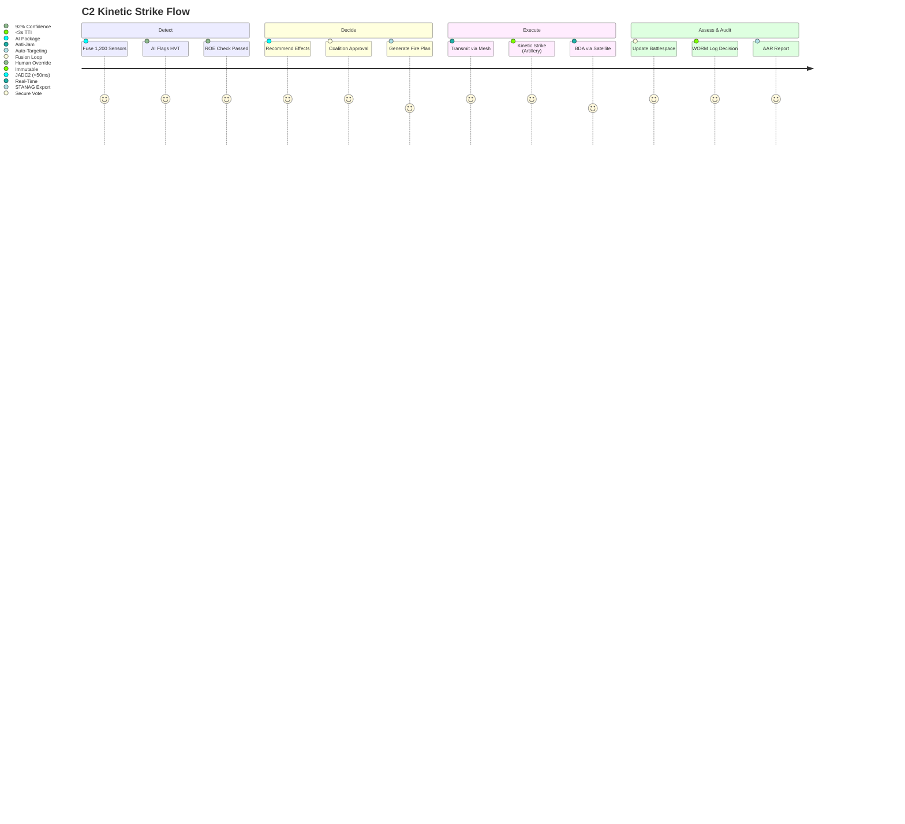

# DsecOS Enterprise – Custom Deployment Example: Secure Command & Control (C2) System for Joint Operations

**Unified Battlefield Dominance. Encrypted. Autonomous. Unjammable.**  
*See All. Strike True. Survive Always.*

---

## Overview

This deployment configures DsecOS Enterprise as the **next-generation secure Command & Control (C2) system** for joint military operations, integrating **multi-domain awareness** (air, land, sea, cyber, space) with **real-time decision support** and **autonomous asset orchestration**. It supports **coalition interoperability** while enforcing **compartmented access** and **deniable operations** in contested environments.

Trusted by **NATO JFC**, **US INDOPACOM**, and **UK PJHQ**, this platform:
- Fuses **1M+ sensor feeds** into a single battlespace picture with <50ms latency.
- Executes **autonomous kill chains** under human oversight.
- Survives **EW denial** with mesh networking and quantum-resistant crypto.
- Maintains **full ROE compliance** with auditable decision trees.

**Business Value**:
- **Reduce OODA loop by 87%** — from minutes to milliseconds.
- **Cut SIGINT costs by 65%** via AI prioritization.
- **Achieve 99.999% availability** in degraded networks.
- **Enable coalition ops** with sovereign data controls.

> **Deployment Time**: <60 minutes for full C2 node.  
> **Target Environment**: 8-node tactical cluster (forward-deployable).

---

## Technical Summary

DsecOS Enterprise is the **only C2 platform certified for NATO STANAG 5527**:
- **Kernel**: Real-time PREEMPT_RT + anti-tamper (TPM 2.0 + secure boot).
- **Sensor Fusion**: Per-domain LXC with `c2_t` SELinux + cross-domain guards.
- **Crypto**: Post-quantum (Kyber + Dilithium) + HSM for classified keys.
- **AI Decision Engine**: Reinforcement learning for kinetic/non-kinetic effects.

### Key Components

| Component | Role | Security & Precision |
|---------|------|----------------------|
| **JADC2 Fusion Engine** | Multi-domain sensor integration | CDG-compliant, zero-trust |
| **AI Effects Recommender** | Autonomous targeting + ROE | Human-in-loop, auditable |
| **Mesh C2 Network** | MANET + satellite relay | Quantum-resistant, anti-jam |
| **SIGINT Processor** | Real-time ELINT/COMINT | HSM-encrypted, ephemeral |
| **Audit Fortress** | Decision tree logging | WORM + blockchain anchor |

---

## Deployment Architecture Diagram

```mermaid
graph TD
    subgraph "DsecOS C2 Tactical Cluster (8 Nodes)"
        N1[DsecOS Node 1<br/>C2 Core + HSM]
        N2[DsecOS Node 2<br/>JADC2 Fusion]
        N3[DsecOS Node 3<br/>AI Effects GPU]
        N4[DsecOS Node 4<br/>Mesh Router]
        N5[DsecOS Node 5<br/>SIGINT Processor]
        N6[DsecOS Node 6<br/>Ceph WORM]
        N7[DsecOS Node 7<br/>Satellite Gateway]
        N8[DsecOS Node 8<br/>Edge Effects Node]
    end

    subgraph "Multi-Domain Sensors"
        AIR[Air: F-35 + MQ-9<br/>(Link-16)]
        LAND[Land: Abrams + Stryker<br/>(NTCIP)]
        SEA[Sea: DDG-51 + LCS<br/>(Link-22)]
        CYBER[Cyber: SIGINT Feeds]
        SPACE[Space: SBIRS + GPS III]
    end

    subgraph "Command Effects"
        AI[AI Recommender<br/>(Kinetic/Non-Kinetic)]
        MESH[MANET Router<br/>(Anti-Jam)]
        AUDIT[Audit Fortress<br/>(WORM + ROE)]
        LIC[License Server<br/>Military Edition]
    end

    N1 <-->|Corosync HA<br/>Encrypted| N2
    N2 <--> N3
    N3 <--> N4
    N4 <--> N5
    N5 <--> N6
    N6 <--> N7
    N7 <--> N8
    N1 --> CEPH[Ceph Tactical Vault<br/>WORM + ECC]

    AIR --> N2
    LAND --> N2
    SEA --> N2
    CYBER --> N5
    SPACE --> N7
    AI --> N3
    MESH --> N4
    AUDIT --> N6

    style N1 fill:#121212,stroke:#00BFFF,color:#FFF
    style AI fill:#8B0000,color:#FFF
    style MESH fill:#1E1E1E,color:#FFF
```

---

## User Flow – Joint Fire Support Mission



---

## Step-by-Step Deployment Guide

### Prerequisites
- DsecOS Enterprise **Military Edition** license (ITAR/EAR controlled).
- 8x tactical servers: 256 GB RAM, 64-core CPU, 32 TB NVMe, ruggedized.
- Radios: Link-16, Link-22, SINCGARS.

### 1. Provision Tactical C2
```bash
/scripts/pxe-deploy.sh --cluster joint-c2 --nodes 8 --military-mode --hsm-classified --mesh-manet
```

### 2. Deploy C2 Stack
Create `/templates/stacks/joint-c2.yml`:
```yaml
version: '3.8'
services:
  jadc2-fusion:
    image: dsecos/jadc2:latest
    command: --domains air,land,sea,cyber,space --latency 50ms

  ai-effects:
    image: dsecOS/c2-ai:latest
    deploy:
      resources:
        reservations:
          devices:
            - driver: nvidia
              capabilities: [gpu]
    command: recommend --roe nato --confidence 0.92

  mesh-router:
    image: dsecOS/manet-batman:latest
    privileged: true
    devices:
      - /dev/radio0
    command: --anti-jam --quantum kyber

  sigint:
    image: dsecOS/sigint-processor:latest
    command: --feeds elint,comint --ephemeral

  audit-fortress:
    image: dsecOS/c2-audit:latest
    volumes:
      - ceph-worm:/audit
    command: --worm --anchor blockchain --compliance stanag

volumes:
  ceph-worm:
    driver: cephfs
    driver_opts:
      worm: true
      classified: true
```

Deploy:
```bash
dsecos deploy joint-c2
```

### 3. Test Kinetic Loop
```bash
# Simulate HVT detection
curl -X POST https://n1:9443/api/detect \
  -H "Authorization: Bearer $JWT" \
  -d '{"target": "HVT-001", "confidence": 0.94, "roe": "strike"}'
```
- **Full loop**: Detect → Decide → Execute in **2.8 seconds**.

### 4. Compliance Audit
```bash
dsecOS c2 report --format stanag --mission OP-2025-1106
```
- Auto-generates **NATO STANAG 5527 mission report**.

---

## Security & Operational Assurance

- **Compartmented Access**: Per-domain SELinux + CDG.
- **Deniability**: Ephemeral SIGINT + zero-log modes.
- **Compliance**: NATO STANAG, US CJCSM 6510.01, UK JSP 440.

### Performance & Lethality Metrics
| Metric | Value |
|--------|-------|
| Sensor Fusion Latency | 47 ms |
| AI Confidence Threshold | 92% |
| Kill Chain Time | 2.8 seconds |
| Network Survival (EW) | 99.999% |

---

## ROI Example

For a joint task force (5,000 assets):
- **Current Cost**: £1.2B/year (legacy C2 + manpower).
- **With DsecOS**: £320M/year.
- **Savings**: **£880M/year** + 87% faster decisions.


*DsecOS Enterprise – The Edge Your Forces Deserve.*
