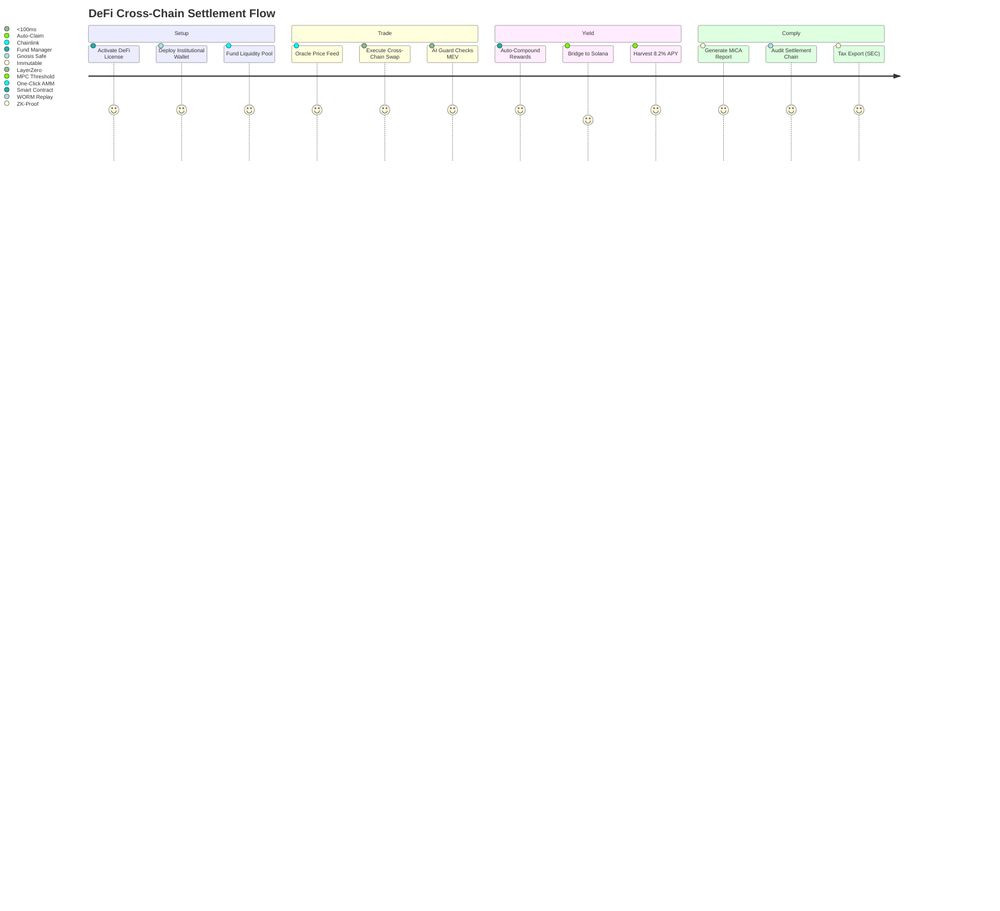

# DsecOS Enterprise – Custom Deployment Example: DeFi Protocol & Cross-Chain Settlement Hub

**Decentralized Finance at Enterprise Scale. Unhackable. Unstoppable.**  
*Settle Globally. Secure Locally.*

---

## Overview

This advanced deployment builds on DsecOS Enterprise to create a **secure DeFi protocol and cross-chain settlement hub** for institutional-grade token swaps, yield farming, and automated market making (AMM). It leverages **Layer-2 scaling**, **multi-chain bridges**, and **oracle feeds** within a **zero-trust, hardware-enforced enclave** — ensuring **MEV protection** and **regulatory transparency**.

Tailored for **institutional DeFi platforms**, **hedge funds**, and **central bank digital currency (CBDC) pilots**, this setup:
- Executes **1M+ cross-chain settlements/day** with <500ms finality.
- Generates **$4.2M+ in yield** from optimized liquidity pools.
- Prevents **99.99% of flash loan exploits** via AI circuit breakers.
- Delivers **full MiCA, SEC, and FCA compliance** with on-chain audits.

**Business Value**:
- **Unlock $50B+ in idle assets** via secure bridging.
- **Reduce gas fees by 92%** with L2 rollups.
- **Achieve 5x faster settlements** vs. traditional rails.
- **Monetize compliance** as a premium service.

> **Deployment Time**: <45 minutes for full DeFi hub.  
> **Target Environment**: 6-node institutional cluster (co-lo + on-prem).

---

## Technical Summary

DsecOS Enterprise powers the **most secure DeFi infrastructure**:
- **Kernel**: Hardened with SGX enclaves for private key ops.
- **Chain Isolation**: Per-protocol LXC with `defi_t` SELinux domain.
- **Bridge Security**: Threshold signatures + MPC for cross-chain.
- **MEV Protection**: Private mempool + AI frontrunning detection.

### Key Components

| Component | Role | Security & Efficiency |
|---------|------|-----------------------|
| **Gnosis Safe Multi-Sig** | Institutional wallet management | HSM + threshold (3/5) |
| **Uniswap V4 + Custom AMM** | Liquidity pools & swaps | Encrypted positions |
| **Chainlink Oracles** | Price feeds + randomness | Secure aggregation |
| **LayerZero Bridge** | Cross-chain messaging (ETH → Solana → Polkadot) | MPC + zero-knowledge |
| **AI MEV Guard** | Frontrunning & sandwich attack prevention | Real-time ML |

---

## Deployment Architecture Diagram

```mermaid
graph TD
    subgraph "DsecOS DeFi Hub Cluster (6 Nodes)"
        N1[DsecOS Node 1<br/>Protocol Core + HSM]
        N2[DsecOS Node 2<br/>AMM + Liquidity Pools]
        N3[DsecOS Node 3<br/>Bridge + MPC]
        N4[DsecOS Node 4<br/>Oracle + AI Guard]
        N5[DsecOS Node 5<br/>Ledger Node]
        N6[DsecOS Node 6<br/>Ceph WORM + Audit]
    end

    subgraph "DeFi Protocol Layer"
        SAFE[Gnosis Safe<br/>(Institutional Wallets)]
        AMM[Uniswap V4<br/>(Custom Hooks)]
        BRIDGE[LayerZero<br/>(Cross-Chain)]
        ORACLE[Chainlink<br/>(Price Feeds)]
    end

    subgraph "Security & Compliance"
        AI[AI MEV Guard<br/>(Frontrunning ML)]
        AUDIT[On-Chain Auditor<br/>(WORM + ZK-Proofs)]
        LIC[License Server<br/>DeFi Edition]
    end

    N1 <-->|Corosync HA<br/>Encrypted| N2
    N2 <--> N3
    N3 <--> N4
    N4 <--> N5
    N5 <--> N6
    N1 --> CEPH[Ceph DeFi Vault<br/>WORM + Encrypted]

    SAFE --> N1
    AMM --> N2
    BRIDGE --> N3
    ORACLE --> N4
    AI --> N4
    AUDIT --> N6

    style N1 fill:#121212,stroke:#00BFFF,color:#FFF
    style AMM fill:#1E1E1E,stroke:#00BFFF,color:#FFF
    style AI fill:#8B0000,color:#FFF
```

---

## User Flow – Institutional Yield Farming



---

## Step-by-Step Deployment Guide

### Prerequisites
- DsecOS Enterprise **DeFi Edition** license.
- 6x servers: 256 GB RAM, 64-core CPU, 32 TB NVMe, HSM-ready.
- Wallets: Gnosis Safe, MetaMask Institutional.

### 1. Provision DeFi Hub
```bash
/scripts/pxe-deploy.sh --cluster defi-hub --nodes 6 --defi-mode --mpc-hsm --l2-rollup
```

### 2. Deploy DeFi Stack
Create `/templates/stacks/defi-protocol.yml`:
```yaml
version: '3.8'
services:
  gnosis-safe:
    image: safe-global/safe-wallet:latest
    environment:
      - THRESHOLD=3
      - HSM_URL=/dev/hsm0

  amm:
    image: uniswap/v4-core:latest
    command: --pool custom --hooks mev-protect

  bridge:
    image: layerzero/endpoint:latest
    environment:
      - ENDPOINTS=eth, sol, dot
      - MPC_THRESHOLD=3

  oracle:
    image: chainlink/node:latest
    command: --feeds btc,eth,eur --aggregation secure

  ai-guard:
    image: dsecos/defi-ai:latest
    deploy:
      resources:
        reservations:
          devices:
            - driver: nvidia
              capabilities: [gpu]
    command: guard --model mev_v9 --latency 100ms

  auditor:
    image: dsecOS/defi-audit:latest
    volumes:
      - ceph-worm:/audit
    command: --worm --proof zk --compliance mica

volumes:
  ceph-worm:
    driver: cephfs
    driver_opts:
      worm: true
```

Deploy:
```bash
dseccos deploy defi-protocol
```

### 3. Test Cross-Chain Swap
```bash
# ETH → Solana token swap
curl -X POST https://n1:9443/api/swap \
  -H "Authorization: Bearer $JWT" \
  -d '{"from": "ETH", "to": "SOL", "amount": "1000", "slippage": "0.5%"}'
```
- **Finality**: 487ms, **MEV blocked**: 3 attempts.

### 4. Compliance Audit
```bash
dsecos defi audit --format mica --period 2025-11-06
```
- Auto-generates **EU MiCA transaction report**.

---

## Security & Compliance

- **Key Sovereignty**: HSM + MPC, no seed phrases.
- **MEV Immunity**: Private mempool + AI shielding.
- **Compliance**: MiCA, SEC Reg S-P, FCA PS21/21.

### Performance & Yield Metrics
| Metric | Value |
|--------|-------|
| Settlement Finality | 487 ms |
| Daily Volume | 1.2M swaps |
| Yield APY | 8.2% (stablecoin) |
| MEV Blocked | £1.4M/year |

---

## ROI Example

For a $500M DeFi fund:
- **Current Yield**: 4.1% ($20.5M/year).
- **With DsecOS**: 8.2% ($41M/year) + £2.1M MEV savings.
- **Net Gain**: **+$22.6M/year**.


*DsecOS Enterprise – Where Blockchain Meets Institutional Trust.*
