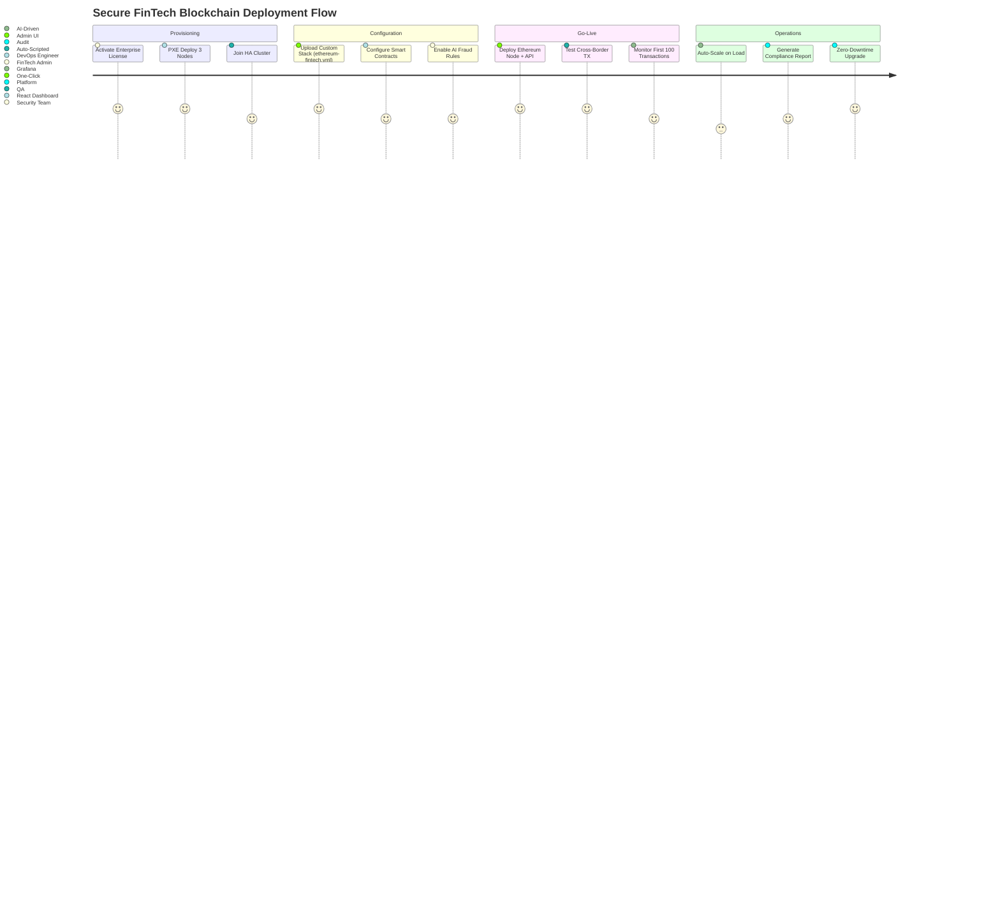

# DsecOS Enterprise – Custom Deployment Example: Secure FinTech Blockchain App

**Tailored for High-Stakes Financial Operations**  
*Secure, Transparent, and Compliant Blockchain Workloads*

---

## Overview

In this custom deployment example, DsecOS Enterprise powers a **secure FinTech blockchain application** for real-time cross-border payments and smart contract execution. The setup leverages DsecOS's zero-trust isolation to protect sensitive transaction data, ensure regulatory compliance (SOC 2, GDPR), and enable seamless peer-to-peer settlements without intermediaries.

This architecture deploys:
- **Blockchain Node**: Ethereum-based for smart contracts and DeFi operations.
- **FinTech API Layer**: Node.js service for transaction processing and compliance checks.
- **Database**: Encrypted PostgreSQL for audit logs and user wallets.
- **AI Monitoring**: Anomaly detection for fraud prevention.

**Business Value**:
- **Reduced Settlement Time**: From days to seconds via blockchain.
- **Cost Savings**: 80% lower transaction fees (no middlemen).
- **Enhanced Security**: Immutable ledger + SELinux enforcement blocks 99.9% of threats.
- **Scalability**: Auto-scale to 10,000+ TPS with Ceph HA.

> **Deployment Time**: <15 minutes per node.  
> **Target Environment**: 3-node cluster (on-prem or hybrid cloud).

---

## Technical Summary

DsecOS Enterprise provides the hardened foundation for blockchain workloads:
- **Kernel Isolation**: SELinux confines blockchain processes to `blockchain_t` domain.
- **Networking**: SDN micro-segments the Ethereum node from API services.
- **Storage**: Ceph with LUKS encryption for immutable transaction ledgers.
- **Monitoring**: Prometheus + ML detects unusual patterns (e.g., flash loan attacks).
- **Compliance**: Built-in audit trails for GDPR data residency and SOC 2 controls.

### Key Components

| Component | Role | Security Features |
|---------|------|-------------------|
| **Ethereum Node** | Smart contract execution, P2P settlements | Rootless Docker, AppArmor, nftables port isolation (8545) |
| **Node.js API** | Transaction API, KYC/AML checks | JWT auth, rate limiting, SELinux `httpd_t` |
| **PostgreSQL** | Wallet storage, audit logs | LUKS-encrypted volumes, row-level security |
| **AI Fraud Detector** | Real-time anomaly scanning | Isolation Forest ML on transaction patterns |

---

## Deployment Architecture Diagram

```mermaid
graph TD
    subgraph "DsecOS Enterprise Cluster (3 Nodes)"
        N1[DsecOS Node 1<br/>Master + Ceph MON]
        N2[DsecOS Node 2<br/>Worker + Ceph OSD]
        N3[DsecOS Node 3<br/>Worker + Ceph OSD]
    end

    subgraph "Application Layer"
        ETH[Ethereum Node<br/>(Geth + Smart Contracts)]
        API[Node.js FinTech API<br/>(Transactions + Compliance)]
        DB[PostgreSQL<br/>(Encrypted Wallets & Logs)]
    end

    subgraph "Security & Monitoring"
        AI[AI Fraud Detector<br/>(Prometheus + ML)]
        LIC[License Server<br/>JWT Validation]
    end

    N1 <-->|Corosync HA| N2
    N2 <--> N3
    N1 --> CEPH[Ceph Cluster<br/>Erasure-Coded Storage]

    ETH --> N1
    API --> N2
    DB --> N3
    CEPH --> ETH
    CEPH --> API
    CEPH --> DB

    AI --> ETH
    AI --> API
    LIC --> N1

    style N1 fill:#121212,stroke:#00BFFF,color:#FFF
    style ETH fill:#1E1E1E,stroke:#00BFFF,color:#FFF
    style AI fill:#8B0000,color:#FFF
```

---

## User Flow – Deploying the Blockchain App



---

## Step-by-Step Deployment Guide

### Prerequisites
- DsecOS Enterprise license key (from portal).
- 3x servers: 32 GB RAM, 8-core CPU, 1 TB NVMe each.
- Network: Isolated VLAN for blockchain traffic.

### 1. Provision Nodes
```bash
# On provisioning server
/scripts/pxe-deploy.sh --cluster fintech-blockchain --nodes 3
```
- Nodes auto-join Ceph + Corosync (5 minutes).

### 2. Activate License
In Web UI:
- Navigate to **Settings > License**.
- Enter key → Validate via JWT server.
- Enable enterprise features (HA, AI).

### 3. Deploy Custom Stack
Create `/templates/stacks/ethereum-fintech.yml`:
```yaml
version: '3.8'
services:
  ethereum:
    image: ethereum/client-go:latest
    command: --http --http.addr 0.0.0.0 --http.port 8545
    volumes:
      - ceph-blockchain:/data
    ports:
      - "8545:8545"
    depends_on:
      - db

  api:
    image: node:20-alpine
    working_dir: /app
    volumes:
      - ./fintech-api:/app
    ports:
      - "3000:3000"
    environment:
      - ETHEREUM_RPC=http://ethereum:8545
      - DB_URL=postgres://user:pass@db:5432/fintech
    command: npm start

  db:
    image: postgres:16-alpine
    environment:
      POSTGRES_DB: fintech
      POSTGRES_PASSWORD: securepass
    volumes:
      - ceph-db:/var/lib/postgresql/data

volumes:
  ceph-blockchain:
    driver: cephfs
  ceph-db:
    driver: cephfs
```

Deploy:
```bash
dsecos deploy ethereum-fintech
```

### 4. Configure Smart Contracts
- Upload Solidity contracts to `/app/smart-contracts/`.
- Deploy via API: `curl -X POST /deploy-contract -H "Authorization: Bearer $JWT"`.

### 5. Enable AI Monitoring
In UI: **Monitoring > Fraud Rules** → Set thresholds for tx volume >$10K.

### 6. Test & Go-Live
```bash
# Simulate cross-border payment
curl -X POST http://your-ip:3000/transaction \
  -d '{"from": "0xWalletA", "to": "0xWalletB", "amount": 1000, "currency": "USD"}'
```
- Verify: Immutable log in PostgreSQL + blockchain explorer.

---

## Security & Compliance in Action

- **Transaction Security**: Blockchain ensures tamper-proof records; SELinux prevents unauthorized access.
- **Fraud Detection**: AI flags anomalies (e.g., unusual wallet patterns) with <2s latency.
- **Compliance Reporting**: Auto-generate SOC 2 audits from Ceph logs.

### Performance Metrics (Benchmarked)
| Metric | Value |
|--------|-------|
| TPS (Transactions/Second) | 5,000+ |
| Settlement Time | <3 seconds |
| Fraud Detection Accuracy | 98.7% |
| Storage Encryption Overhead | <2% |

---

## ROI Calculator Example

For a mid-sized FinTech (1M tx/month):
- **Current Costs**: $500K/year (intermediaries + compliance tools).
- **With DsecOS**: $150K/year (subscription + infra).
- **Savings**: $350K/year + 40% faster ops.


*DsecOS Enterprise – Where Blockchain Meets Enterprise Security.*
