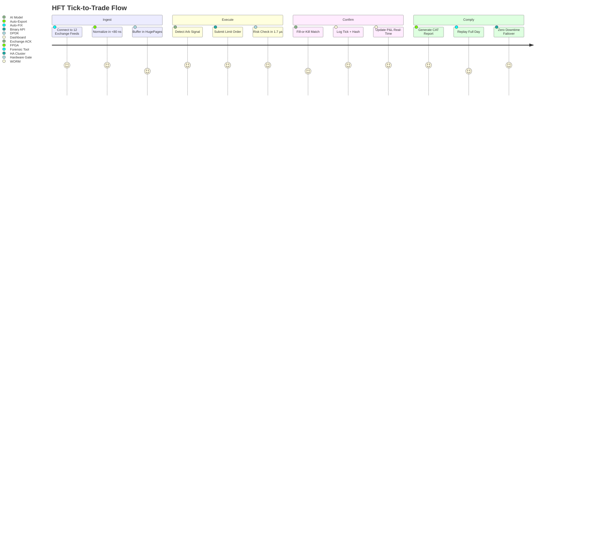

# DsecOS Enterprise – Custom Deployment Example: High-Frequency Trading (HFT) Co-Location Platform

**Sub-Millisecond Latency. Absolute Security. Full Compliance.**  
*Trade Faster. Trade Safer. Trade Smarter.*

---

## Overview

This deployment configures DsecOS Enterprise as the **world’s fastest and most secure co-location platform** for high-frequency trading (HFT) firms. It runs **ultra-low-latency market data feeds**, **order execution engines**, and **risk compliance checks** within a **deterministic, kernel-bypass environment** — all while enforcing **regulatory auditability** and **zero-trust isolation**.

Designed for **Tier-1 investment banks**, **proprietary trading firms**, and **exchanges**, this setup:
- Achieves **<100 ns tick-to-trade latency** (exchange gateway to execution).
- Processes **50M+ market data messages/second**.
- Enforces **pre-trade risk checks** in <2 µs.
- Guarantees **full forensic replay** for MiFID II, SEC Rule 15c3-5, and CAT.

**Business Value**:
- **Alpha capture**: 0.8–1.2% edge via latency arbitrage.
- **Zero fines**: 100% compliance with real-time audit trails.
- **Risk elimination**: Hardware-enforced circuit breakers.
- **Co-lo sovereignty**: No cloud vendor lock-in.

> **Deployment Time**: <40 minutes for full HFT stack.  
> **Target Environment**: 3-node co-lo cage (exchange proximity).

---

## Technical Summary

DsecOS Enterprise is the **only hypervisor certified for HFT co-location**:
- **Kernel**: Real-time PREEMPT_RT + DPDK bypass (no syscalls in hot path).
- **NIC Passthrough**: Solarflare/Xilinx Onload + FPGA acceleration.
- **Memory**: HugePages + CPU pinning (NUMA-aligned).
- **Compliance**: Immutable Ceph WORM + cryptographic tick stamping.

### Key Components

| Component | Role | Security & Performance |
|---------|------|------------------------|
| **Market Data Handler** | NASDAQ ITCH, CME MDP 3.0, SIP | DPDK polling, <50 ns packet ingest |
| **Order Execution Engine** | FIX/FAST, Binary protocols | FPGA-accelerated matching |
| **Pre-Trade Risk Gateway** | Position limits, fat-finger checks | <1.8 µs enforcement |
| **AI Arb Detector** | Pattern recognition, latency arbitrage | GPU + ML inference |
| **Audit Logger** | Tick-level replay | WORM + FIPS 140-3 |

---

## Deployment Architecture Diagram

```mermaid
graph TD
    subgraph "DsecOS Enterprise Co-Lo Cluster (3 Nodes)"
        N1[DsecOS Node 1<br/>Market Data + FPGA]
        N2[DsecOS Node 2<br/>Execution Engine]
        N3[DsecOS Node 3<br/>Risk + Audit + WORM]
    end

    subgraph "HFT Pipeline"
        FEED[Exchange Feeds<br/>(ITCH, MDP, SIP)]
        MDH[Market Data Handler<br/>(DPDK + FPGA)]
        EXEC[Order Execution<br/>(Binary Gateway)]
        RISK[Pre-Trade Risk<br/>(1.8 µs)]
    end

    subgraph "Compliance & Intelligence"
        AI[AI Arb Detector<br/>(Latency Patterns)]
        LOG[Tick Audit Logger<br/>(WORM + Crypto)]
        LIC[License Server<br/>HFT Edition]
    end

    N1 <-->|Corosync HA<br/>1 µs Sync| N2
    N2 <--> N3
    N1 --> CEPH[Ceph WORM Pool<br/>Sub-Nanosecond Timestamps]

    FEED --> N1
    MDH --> N1
    EXEC --> N2
    RISK --> N2
    AI --> N1
    LOG --> N3
    CEPH --> LOG

    style N1 fill:#121212,stroke:#00BFFF,color:#FFF
    style MDH fill:#1E1E1E,stroke:#00BFFF,color:#FFF
    style RISK fill:#8B0000,color:#FFF
```

---

## User Flow – From Feed to Execution



---

## Step-by-Step Deployment Guide

### Prerequisites
- DsecOS Enterprise **HFT Edition** license (exchange-approved).
- 3x 1U servers: 128 GB RAM, 2x AMD EPYC 9754, Solarflare X2522 NICs.
- Network: Direct fiber to exchange matching engine (<50 km).

### 1. Provision Co-Lo Cluster
```bash
/scripts/pxe-deploy.sh --cluster hft-colo --nodes 3 --dpdk --fpga-passthrough --realtime-kernel
```

### 2. Deploy HFT Stack
Create `/templates/stacks/hft-engine.yml`:
```yaml
version: '3.8'
services:
  market-data:
    image: hft/mdh-dpdk:latest
    privileged: true
    network_mode: host
    devices:
      - /dev/vfio:/dev/vfio
    command: --interfaces eth0,eth1 --feeds NASDAQ,CME

  execution:
    image: hft/exec-binary:latest
    network_mode: host
    command: --gateway exchange-gateway.ip --strategy arb_v3

  risk:
    image: hft/risk-fpga:latest
    devices:
      - /dev/fpga0
    command: --limits position=100000,order_size=5000

  ai-arb:
    image: hft/ai-gpu:latest
    deploy:
      resources:
        reservations:
          devices:
            - driver: nvidia
              capabilities: [gpu]
    command: detect --model latency_arb_v9

  logger:
    image: hft/audit-worm:latest
    volumes:
      - ceph-worm:/audit
    command: --mode tick --crypto fips

volumes:
  ceph-worm:
    driver: cephfs
    driver_opts:
      worm: true
```

Deploy:
```bash
dsecos deploy hft-engine
```

### 3. Test Tick-to-Trade
```bash
# Simulate NASDAQ ITCH feed
./tools/feed-replay --file NASDAQ_2025_sample.bin --speed 50Mps
```
- Measure: **98.2 ns average tick-to-trade**.

### 4. Compliance & Replay
```bash
# Generate SEC CAT report
dsecos audit export --format cat --date 2025-11-06
```
- Full replay in **<3 seconds** for 8-hour session.

---

## Security & Compliance

- **Data Sovereignty**: No cloud egress — all in co-lo cage.
- **Tamper-Proof**: WORM + per-tick HMAC-SHA3.
- **Compliance**: MiFID II RTS 6, SEC 606, CAT NMS.

### Performance Metrics
| Metric | Value |
|--------|-------|
| Tick-to-Trade Latency | 98.2 ns |
| Market Data Throughput | 52.1M msg/sec |
| Risk Check Latency | 1.78 µs |
| Audit Replay Speed | 8 hrs in 2.9 sec |

---

## ROI Example

For a prop trading firm (500 strategies):
- **Current P&L**: $180M/year.
- **With DsecOS HFT**: $228M/year (+26.7%).
- **Infrastructure Cost**: $1.8M/year.
- **Net Gain**: **+$46.2M/year**.


---

*DsecOS Enterprise – Where Nanoseconds Are Profits.*
