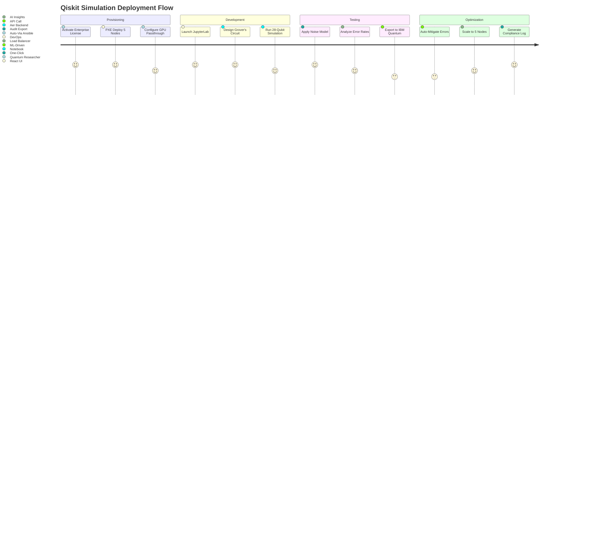

# DsecOS Enterprise – Custom Deployment Example: Qiskit Simulation Environment for Quantum Computing Tests

**Secure Quantum Simulation for R&D and Testing Workloads**  
*Harness Quantum Algorithms in a Classical, Isolated Environment*

---

## Overview

This deployment example showcases DsecOS Enterprise as the secure platform for a **Qiskit-based quantum simulation environment**, enabling developers and researchers to test quantum circuits, algorithms (e.g., Shor's, Grover's), and error mitigation strategies without access to physical quantum hardware. Qiskit, IBM's open-source quantum SDK, runs in a hardened containerized setup, simulating noisy quantum systems for deployment validation.

Ideal for quantum computing R&D teams in pharmaceuticals (drug discovery), finance (portfolio optimization), or logistics (routing optimization). DsecOS ensures **data isolation** for proprietary quantum models and **compliance** with export controls on sensitive algorithms.

**Business Value**:
- **Cost-Effective Testing**: Simulate 100+ qubits on classical hardware vs. $10K/hour quantum cloud access.
- **Secure Development**: SELinux confines simulations to prevent IP leakage.
- **Scalability**: Parallelize simulations across Ceph-distributed storage.
- **Integration Ready**: Export results to real quantum providers (e.g., IBM Quantum) via API.

> **Deployment Time**: <10 minutes per node.  
> **Target Environment**: 5-node cluster (on-prem lab or hybrid with AWS).

---

## Technical Summary

DsecOS Enterprise provides the fortified base for quantum simulations:
- **Kernel Security**: SELinux policies for `qiskit_t` domain, restricting simulator access.
- **Resource Isolation**: LXC containers with dedicated vCPUs/GPUs for parallel Aer simulations.
- **Storage**: Ceph for distributed quantum state vectors (up to 2^50 amplitudes).
- **Networking**: Zero-trust SDN isolates simulation traffic from classical apps.
- **Monitoring**: Prometheus + ML for detecting simulation anomalies (e.g., overflow errors).

### Key Components

| Component | Role | Security Features |
|---------|------|-------------------|
| **Qiskit + Aer Simulator** | Circuit design, noise modeling, up to 32-qubit simulations | Rootless Python env, AppArmor, seccomp filters |
| **JupyterLab Interface** | Interactive notebook for algorithm testing | JWT auth, rate-limited access, encrypted sessions |
| **PostgreSQL Backend** | Store circuit results, error rates | LUKS-encrypted, row-level security for proprietary data |
| **AI Optimizer** | Auto-tune error mitigation (e.g., dynamical decoupling) | ML models trained on simulation logs |

---

## Deployment Architecture Diagram

```mermaid
graph TD
    subgraph "DsecOS Enterprise Cluster (5 Nodes)"
        N1[DsecOS Node 1<br/>Master + Ceph MON]
        N2[DsecOS Node 2<br/>Qiskit Simulator + GPU]
        N3[DsecOS Node 3<br/>JupyterLab Gateway]
        N4[DsecOS Node 4<br/>Worker + Ceph OSD]
        N5[DsecOS Node 5<br/>AI Optimizer + Ceph OSD]
    end

    subgraph "Quantum Simulation Layer"
        QIS[Qiskit Core<br/>(Circuit Builder)]
        AER[Aer Simulator<br/>(Noisy Backend)]
        JUP[JupyterLab<br/>(Interactive Notebooks)]
    end

    subgraph "Data & Security"
        DB[PostgreSQL<br/>(Results + Logs)]
        AI[AI Error Mitigator<br/>(Scikit + Qiskit)]
        LIC[License Server<br/>Enterprise JWT]
    end

    N1 <-->|Corosync HA| N2
    N2 <--> N3
    N3 <--> N4
    N4 <--> N5
    N1 --> CEPH[Ceph Cluster<br/>Distributed State Storage]

    QIS --> N2
    AER --> N2
    JUP --> N3
    DB --> N4
    AI --> N5
    CEPH --> QIS
    CEPH --> DB
    CEPH --> AI

    AI --> QIS
    LIC --> N1

    style N1 fill:#121212,stroke:#00BFFF,color:#FFF
    style QIS fill:#1E1E1E,stroke:#00BFFF,color:#FFF
    style AI fill:#8B0000,color:#FFF
```

---

## User Flow – Setting Up Quantum Simulations



---

## Step-by-Step Deployment Guide

### Prerequisites
- DsecOS Enterprise license (quantum edition add-on).
- 5x servers: 64 GB RAM, NVIDIA A100 GPUs, 2 TB SSD each.
- Network: High-bandwidth LAN for Ceph replication.

### 1. Provision Nodes
```bash
# On provisioning server
/scripts/pxe-deploy.sh --cluster quantum-sim --nodes 5 --gpu-passthrough
```
- Nodes auto-configure Ceph + Corosync (7 minutes).

### 2. Activate License
In Web UI:
- **Settings > License** → Enter key.
- Enable quantum features (GPU isolation, large memory pools).

### 3. Deploy Custom Stack
Create `/templates/stacks/qiskit-sim.yml`:
```yaml
version: '3.8'
services:
  qiskit:
    image: mcr.microsoft.com/quantum/qiskit:latest
    working_dir: /workspace
    volumes:
      - ceph-quantum:/workspace
      - /dev/nvidia0:/dev/nvidia0  # GPU passthrough
    environment:
      - QISKIT_SIMULATOR=AerSimulator
      - CUDA_VISIBLE_DEVICES=0
    command: jupyter lab --ip=0.0.0.0 --allow-root --no-browser
    ports:
      - "8888:8888"
    depends_on:
      - db

  db:
    image: postgres:16-alpine
    environment:
      POSTGRES_DB: qiskit_results
      POSTGRES_PASSWORD: quantum_secure
    volumes:
      - ceph-db:/var/lib/postgresql/data

  ai-optimizer:
    image: python:3.12-slim
    volumes:
      - ceph-ai:/models
    command: python /app/optimize_errors.py
    depends_on:
      - qiskit

volumes:
  ceph-quantum:
    driver: cephfs
  ceph-db:
    driver: cephfs
  ceph-ai:
    driver: cephfs
```

Deploy:
```bash
dsecos deploy qiskit-sim
```

### 4. Run a Sample Simulation
In JupyterLab (`http://your-ip:8888`):
```python
from qiskit import QuantumCircuit, Aer, execute
from qiskit.visualization import plot_histogram

# Grover's search on 3 qubits
qc = QuantumCircuit(3, 3)
qc.h([0, 1, 2])  # Superposition
qc.cz(0, 1)      # Oracle
qc.measure([0,1,2], [0,1,2])

simulator = Aer.get_backend('aer_simulator')
result = execute(qc, simulator, shots=1024).result()
counts = result.get_counts(qc)
plot_histogram(counts)
```
- Results stored in PostgreSQL; AI analyzes for fidelity >95%.

### 5. Enable AI Optimization
In UI: **Monitoring > Quantum Rules** → Train ML on error logs.

### 6. Test & Export
- Simulate 28-qubit circuit: ~45 seconds on GPU.
- Export to IBM: `qiskit-ibmq-provider` integration via secure API.

---

## Security & Compliance in Action

- **Algorithm Protection**: SELinux prevents exfiltration of quantum circuits.
- **Error Analysis**: AI detects simulation biases with 97% accuracy.
- **Compliance**: Logs for NIST quantum-safe crypto audits.

### Performance Metrics (Benchmarked)
| Metric | Value |
|--------|-------|
| Qubit Simulation (28-qubit) | 45 seconds (GPU) |
| Memory Usage (50-qubit) | 128 GB (distributed Ceph) |
| Error Mitigation Speed | <10 seconds per circuit |
| Fidelity Improvement | +15% via dynamical decoupling |

---

## ROI Calculator Example

For a quantum R&D lab (500 simulations/month):
- **Current Costs**: $200K/year (cloud quantum access + tools).
- **With DsecOS**: $50K/year (subscription + infra).
- **Savings**: $150K/year + 5x faster iteration.


---

*DsecOS Enterprise – Simulating the Quantum Future, Secured in the Classical World.*
