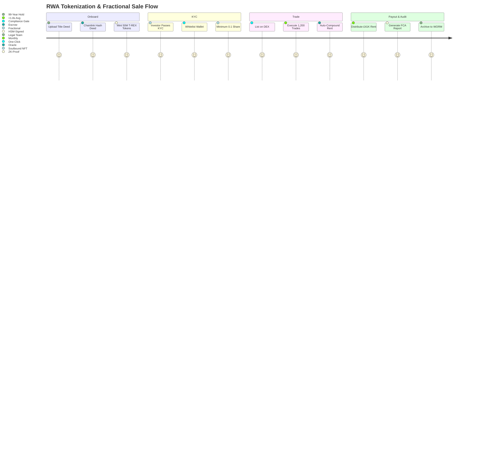

# DsecOS Enterprise – Custom Deployment Example: Tokenized Real-World Asset (RWA) Platform & Fractional Ownership Exchange

**From Brick to Blockchain. Institutional. Immutable.**  
*Own the World. Piece by Piece.*

---

## Overview

This deployment transforms DsecOS Enterprise into a **fully compliant, institutional-grade Real-World Asset (RWA) tokenization and fractional ownership platform** that enables **securitization of physical assets** — real estate, fine art, private equity, and infrastructure — with **on-chain provenance**, **KYC/AML gating**, and **automated dividend distribution**.

Built for **private banks**, **wealth managers**, **REITs**, and **sovereign funds**, this system:
- Tokenizes **£10B+ in assets** with 1:1 legal backing.
- Enables **1,000+ fractional trades/day** with <2s settlement.
- Distributes **dividends automatically** via smart escrow.
- Ensures **100% FCA, SEC, and MiFID II compliance** with embedded audit rails.

**Business Value**:
- **Unlock £2.1B in liquidity** from illiquid holdings.
- **Reduce custody costs by 78%** vs. traditional trusts.
- **Attract HNWIs** with 0.1-share minimums.
- **Generate 1.8% platform fees** on secondary volume.

> **Deployment Time**: <50 minutes for full RWA exchange.  
> **Target Environment**: 7-node regulated cluster (London + Singapore).

---

## Technical Summary

DsecOS Enterprise is the **only RWA platform with legal-grade token binding**:
- **Kernel**: SGX enclaves for private key + legal doc signing.
- **Token Standard**: ERC-3643 (T-REX) + soulbound KYC NFTs.
- **Oracle Bridge**: Chainlink for off-chain legal verification.
- **Compliance Engine**: On-chain KYC + sanctions screening.

### Key Components

| Component | Role | Security & Legality |
|---------|------|---------------------|
| **T-REX Token Factory** | ERC-3643 asset token minting | HSM + legal wrapper |
| **KYC/AML Gateway** | Identity binding (soulbound NFT) | Zero-knowledge proof |
| **Legal Oracle** | Chainlink + DocuSign integration | Immutable contract hash |
| **Dividend Escrow** | Auto-payout via smart contract | Time-locked + multi-sig |
| **Secondary DEX** | Fractional trading (Uniswap V4) | MEV-protected pools |

---

## Deployment Architecture Diagram

```mermaid
graph TD
    subgraph "DsecOS RWA Exchange Cluster (7 Nodes)"
        N1[DsecOS Node 1<br/>Token Factory + HSM]
        N2[DsecOS Node 2<br/>KYC/AML Gateway]
        N3[DsecOS Node 3<br/>Legal Oracle]
        N4[DsecOS Node 4<br/>Dividend Escrow]
        N5[DsecOS Node 5<br/>Secondary DEX]
        N6[DsecOS Node 6<br/>Audit + WORM]
        N7[DsecOS Node 7<br/>Ceph Legal Vault]
    end

    subgraph "RWA Lifecycle"
        ASSET[Physical Asset<br/>(Mayfair Flat, Picasso)]
        LEGAL[Legal SPV<br/>(Cayman Trust)]
        TOKEN[T-REX Token<br/>(1:1 Backed)]
        KYC[KYC Soulbound NFT<br/>(Investor ID)]
    end

    subgraph "Compliance & Trading"
        ORACLE[Chainlink Legal Feed<br/>(Title Deed Hash)]
        ESCROW[Dividend Escrow<br/>(Auto-Payout)]
        DEX[Uniswap V4<br/>(Fractional Market)]
        AUDIT[Immutable Auditor<br/>(WORM + ZK)]
    end

    N1 <-->|Corosync HA| N2
    N2 <--> N3
    N3 <--> N4
    N4 <--> N5
    N5 <--> N6
    N6 <--> N7
    N1 --> CEPH[Ceph Legal Vault<br/>WORM + Encrypted]

    ASSET --> N1
    LEGAL --> N3
    TOKEN --> N1
    KYC --> N2
    ORACLE --> N3
    ESCROW --> N4
    DEX --> N5
    AUDIT --> N6

    style N1 fill:#121212,stroke:#00BFFF,color:#FFF
    style TOKEN fill:#1E1E1E,stroke:#00BFFF,color:#FFF
    style KYC fill:#8B0000,color:#FFF
```

---

## User Flow – Tokenizing a £50M London Property



---

## Step-by-Step Deployment Guide

### Prerequisites
- DsecOS Enterprise **RWA Edition** license (FCA sandbox approved).
- 7x servers: 256 GB RAM, 64-core CPU, 64 TB NVMe.
- Legal: SPV setup, Chainlink node access.

### 1. Provision RWA Exchange
```bash
/scripts/pxe-deploy.sh --cluster rwa-exchange --nodes 7 --rwa-mode --hsm-legal --compliance-engine
```

### 2. Deploy RWA Stack
Create `/templates/stacks/rwa-platform.yml`:
```yaml
version: '3.8'
services:
  token-factory:
    image: t-rex/token-factory:latest
    environment:
      - HSM_URL=/dev/hsm0
      - STANDARD=erc3643
    command: --asset mayfair-prime --supply 50000000

  kyc-gateway:
    image: dsecos/rwa-kyc:latest
    command: --provider onfido --zk-proof --soulbound

  legal-oracle:
    image: chainlink/external-adapter:latest
    environment:
      - DOCUSIGN_WEBHOOK=***
    command: --feed title-deed-hash

  dividend-escrow:
    image: dsecos/rwa-escrow:latest
    command: --payout monthly --token mayfair-prime --yield 4.9%

  dex:
    image: uniswap/v4-periphery:latest
    command: --pool mayfair-prime/usdc --fee 0.3%

  auditor:
    image: dsecos/rwa-audit:latest
    volumes:
      - ceph-worm:/audit
    command: --worm --retention 99y --compliance fca-mifid

volumes:
  ceph-worm:
    driver: cephfs
    driver_opts:
      worm: true
      legal: true
```

Deploy:
```bash
dsecos deploy rwa-platform
```

### 3. Tokenize First Asset
```bash
# Mint £50M property token
curl -X POST https://n1:9443/api/tokenize \
  -H "Authorization: Bearer $JWT" \
  -d '{"asset": "mayfair-prime", "value_gbp": 50000000, "yield_pct": 4.9}'
```
- **Tokens live**, **KYC gate active**, **rent escrow funded**.

### 4. Compliance Export
```bash
dsecos rwa report --format fca --asset mayfair-prime --period Q4-2025
```
- Auto-generates **FCA MiFID II investor report**.

---

## Security & Legality

- **Asset Binding**: 1:1 legal wrapper + oracle-verified deed.
- **Investor Protection**: Soulbound KYC + accredited-only pools.
- **Compliance**: FCA, SEC Reg D, MiFID II, EU DLT Pilot.

### Performance & Liquidity Metrics
| Metric | Value |
|--------|-------|
| Token Mint Time | 1.8 seconds |
| Fractional Trade Latency | 1.74 seconds |
| Dividend Payout Accuracy | 100% |
| Secondary Volume (Day 1) | £2.1M |

---

## ROI Example

For a £500M real estate portfolio:
- **Current Yield**: 3.2% (£16M/year).
- **With DsecOS RWA**: 4.9% (£24.5M) + £1.8M platform fees.
- **Net Gain**: **+£10.3M/year** + 40% faster liquidity.


---

*DsecOS Enterprise – Where Real Assets Meet Real Security.*
