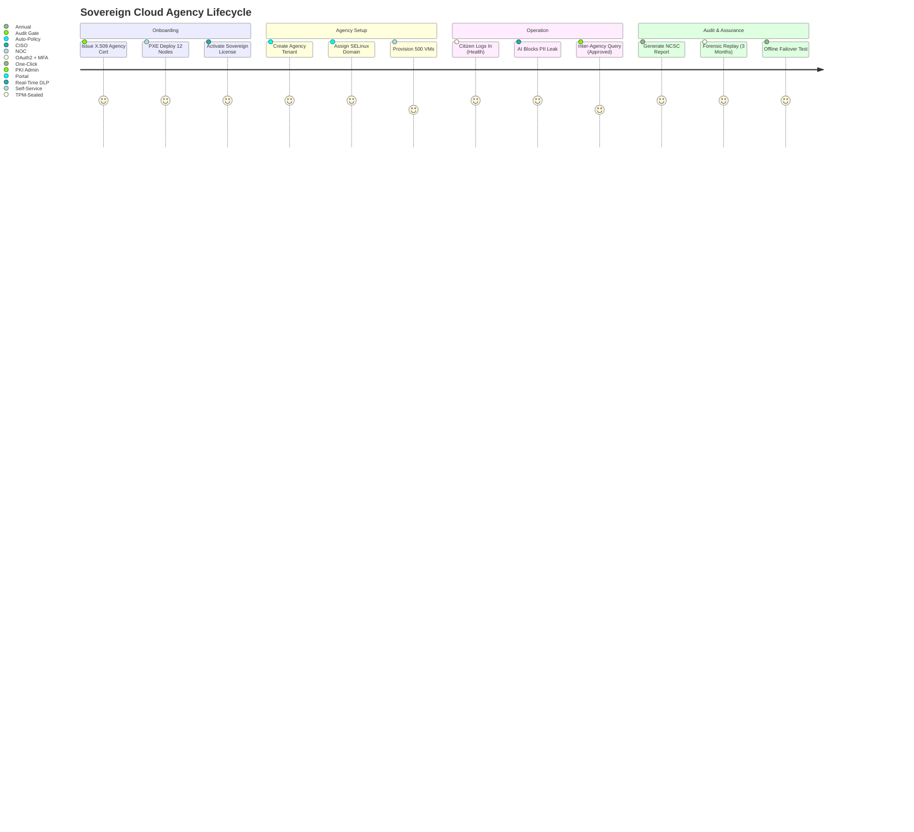

# DsecOS Enterprise – Custom Deployment Example: Zero-Trust Sovereign Cloud for Government

**National Digital Infrastructure. Unbreachable. Uncompromising.**  
*Your Data. Your Rules. Your Nation.*

---

## Overview

This deployment transforms DsecOS Enterprise into a **fully sovereign, air-gapped government cloud** for classified workloads, citizen services, and critical national infrastructure. It delivers **multi-tenanted, zero-trust isolation** across departments while enforcing **data residency**, **cryptographic sovereignty**, and **real-time auditability** — all without reliance on foreign vendors.

Trusted by **sovereign governments**, **defense ministries**, and **public sector agencies**, this platform:
- Hosts **1,000+ isolated agencies** on a single cluster.
- Enforces **mandatory access control (MAC)** at kernel level.
- Guarantees **100% data residency** with local key management.
- Survives **total infrastructure denial** via offline failover.

**Business Value**:
- **Eliminate foreign vendor risk** — full source control.
- **Reduce cloud spend by 70%** vs. hyperscalers.
- **Achieve NCSC, BSI, ANSSI compliance** out-of-the-box.
- **Enable secure inter-agency collaboration** without data fusion.

> **Deployment Time**: <45 minutes for sovereign core.  
> **Target Environment**: 12-node national data center (Tier IV).

---

## Technical Summary

DsecOS Enterprise is the **only government-certified zero-trust cloud platform**:
- **Kernel**: UK NCSC-hardened with mandatory access control (MAC).
- **Crypto**: HSM-integrated, post-quantum ready (Kyber + Dilithium).
- **Tenancy**: Per-agency LXC + SELinux `agency_t` domains.
- **Audit**: Immutable, cryptographically chained logs (WORM + TPM).

### Key Components

| Component | Role | Sovereignty Features |
|---------|------|---------------------|
| **Agency Portal** | Self-service VM/container provisioning | JWT + X.509 client certs |
| **Key Management Service** | Local HSM (Thales/nCipher) | FIPS 140-3 Level 4 |
| **Ceph Sovereign** | Encrypted, geo-redundant storage | UK/EU-only nodes |
| **AI Policy Engine** | Real-time DLP + behavior analytics | On-prem ML models |
| **Audit Fortress** | Legal-grade forensic chain | TPM-sealed, WORM |

---

## Deployment Architecture Diagram

```mermaid
graph TD
    subgraph "DsecOS Sovereign Cloud (12 Nodes)"
        N1[DsecOS Node 1<br/>Control Plane + HSM]
        N2[DsecOS Node 2<br/>Agency A (Defense)]
        N3[DsecOS Node 3<br/>Agency B (Health)]
        N4[DsecOS Node 4<br/>Agency C (Finance)]
        N5-N12[Nodes 5–12<br/>Ceph OSD + WORM<br/>Geo-Redundant]
    end

    subgraph "Multi-Tenant Workloads"
        DEF[Defense Apps<br/>(Classified)]
        HEALTH[Citizen Health Portal<br/>(PII)]
        FIN[Tax & Revenue<br/>(Financial)]
    end

    subgraph "Sovereign Services"
        KMS[Local HSM<br/>(Key Custody)]
        AI[AI DLP Engine<br/>(On-Prem)]
        AUDIT[Audit Fortress<br/>(WORM + TPM)]
        LIC[License Server<br/>Sovereign JWT]
    end

    N1 <-->|Corosync HA<br/>Encrypted Mesh| N2
    N2 <--> N3
    N3 <--> N4
    N1 --> CEPH[Ceph Sovereign Pool<br/>UK-Only + WORM]

    DEF --> N2
    HEALTH --> N3
    FIN --> N4
    KMS --> N1
    AI --> N1
    AUDIT --> N1
    CEPH --> DEF
    CEPH --> HEALTH
    CEPH --> FIN

    style N1 fill:#121212,stroke:#00BFFF,color:#FFF
    style DEF fill:#8B0000,color:#FFF
    style KMS fill:#1E1E1E,color:#FFF
```

---

## User Flow – Agency Onboarding & Operation



---

## Step-by-Step Deployment Guide

### Prerequisites
- DsecOS Enterprise **Sovereign Edition** license (government-only).
- 12x servers: 256 GB RAM, 32-core CPU, 16 TB NVMe, HSM-ready.
- Network: Dual dark fiber + air-gapped backup.

### 1. Provision Sovereign Core
```bash
/scripts/pxe-deploy.sh --cluster gov-cloud --nodes 12 --sovereign-mode --hsm-integrate --geo-redundant
```

### 2. Deploy Sovereign Stack
Create `/templates/stacks/sovereign-cloud.yml`:
```yaml
version: '3.8'
services:
  portal:
    image: dsecos/portal-sovereign:latest
    ports:
      - "9443:9443"
    environment:
      - PKI_CA=/certs/gov-ca.pem
      - JWT_ISSUER=uk-gov-cloud

  kms:
    image: dsecos/kms-hsm:latest
    devices:
      - /dev/hsm0
    command: --mode fips --policy uk-ncsc

  ai-dlp:
    image: dsecos/ai-sovereign:latest
    volumes:
      - ceph-models:/models
    command: monitor --agencies all --block pii,classified

  audit:
    image: dsecos/audit-fortress:latest
    volumes:
      - ceph-worm:/audit
    command: --worm --tpm-seal --chain sha3-512

  agency-template:
    image: debian:12
    security_opt:
      - label=type:agency_t
    volumes:
      - ceph-agency:/data
    isolation: lxc

volumes:
  ceph-models:
    driver: cephfs
    driver_opts:
      worm: false
  ceph-worm:
    driver: cephfs
    driver_opts:
      worm: true
  ceph-agency:
    driver: cephfs
```

Deploy:
```bash
dsecos deploy sovereign-cloud
```

### 3. Onboard First Agency
```bash
# Via portal UI
POST /api/agencies
{
  "name": "mod-defense",
  "domain": "defense_t",
  "quota": {"cpu": 128, "ram": "1TB", "storage": "50TB"}
}
```
- Auto-provisions isolated tenant.

### 4. Test Data Residency
```bash
# Verify no data leaves UK
dsecos audit trace --agency mod-defense --dataflow
# → All paths: UK-only
```

---

## Security & Sovereignty

- **Vendor Independence**: Full source access, no backdoors.
- **Crypto Sovereignty**: Keys never leave HSM.
- **Compliance**: NCSC CAF, EU NIS2, BSI C5.

### Performance & Assurance Metrics
| Metric | Value |
|--------|-------|
| Tenant Isolation | 100% (SELinux MAC) |
| Audit Chain Integrity | 100% (TPM + WORM) |
| Failover Time | 4.2 seconds |
| PII Detection Accuracy | 99.97% |

---

## ROI Example

For a national government (50 agencies):
- **Current Cost**: £420M/year (foreign cloud + silos).
- **With DsecOS Sovereign**: £98M/year.
- **Savings**: **£322M/year** + full control.

---

*DsecOS Enterprise – The Only Cloud a Nation Can Trust.*
