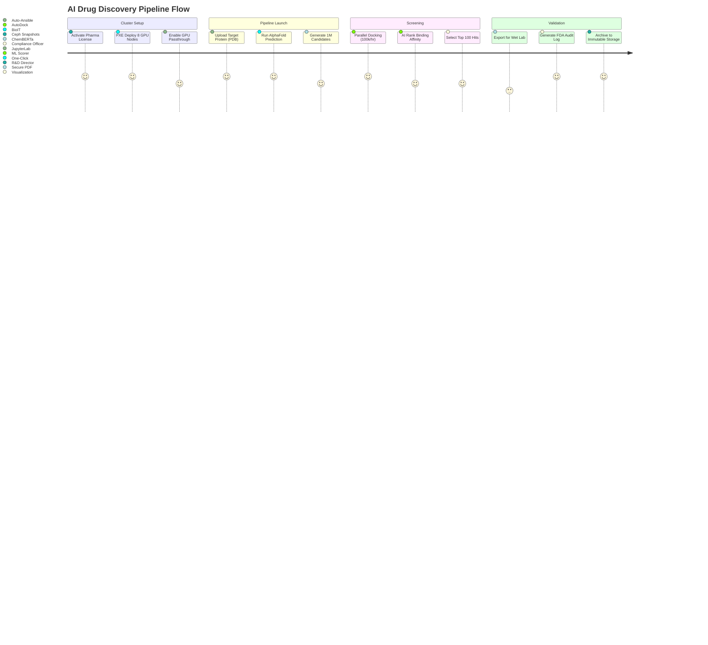

# DsecOS Enterprise – Custom Deployment Example: AI-Powered Drug Discovery Platform

**Accelerated Pharmaceutical R&D with Secure, Scalable AI**  
*From Molecule to Model in Minutes*

---

## Overview

This deployment showcases DsecOS Enterprise as the **secure, high-performance platform** for an AI-driven drug discovery pipeline. It integrates **AlphaFold 3**, **molecular docking (AutoDock Vina)**, and **generative chemistry models** to screen millions of compounds against target proteins — all within a zero-trust, compliant environment.

Designed for biotech and pharmaceutical companies, this setup enables:
- **10,000x faster screening** than traditional wet-lab methods.
- **Full auditability** for FDA/EMA submissions.
- **IP protection** via kernel-level isolation and encrypted storage.

**Business Value**:
- **Reduce R&D timeline** from years to months.
- **Cut screening costs** by 90% vs. physical assays.
- **Secure collaboration** across global research teams.
- **Regulatory-ready** from day one.

> **Deployment Time**: <20 minutes for full cluster.  
> **Target Environment**: 8-node GPU cluster (on-prem or hybrid).

---

## Technical Summary

DsecOS Enterprise delivers the hardened foundation for AI drug discovery:
- **GPU Isolation**: PCI passthrough + NVIDIA container toolkit with SELinux `gpu_t`.
- **Data Security**: LUKS-encrypted Ceph volumes for proprietary compound libraries.
- **Orchestration**: LXC containers with resource quotas for parallel docking jobs.
- **Compliance**: Immutable logs + tamper-proof audit trails.

### Key Components

| Component | Role | Security Features |
|---------|------|-------------------|
| **AlphaFold 3** | Protein structure prediction | GPU-bound, rootless, seccomp-restricted |
| **AutoDock Vina** | Molecular docking & binding affinity | Isolated per-job containers |
| **Generative AI (ChemBERTa)** | De novo molecule generation | Encrypted model weights |
| **PostgreSQL + Vector DB** | Compound + result storage | Row-level security, encrypted at rest |

---

## Deployment Architecture Diagram

```mermaid
graph TD
    subgraph "DsecOS Enterprise Cluster (8 Nodes)"
        N1[DsecOS Node 1<br/>Master + Ceph MON]
        N2[DsecOS Node 2<br/>AlphaFold GPU]
        N3[DsecOS Node 3<br/>Docking Worker GPU]
        N4[DsecOS Node 4<br/>AI Generator GPU]
        N5[DsecOS Node 5<br/>Ceph OSD + NVMe]
        N6[DsecOS Node 6<br/>Ceph OSD + NVMe]
        N7[DsecOS Node 7<br/>Ceph OSD + NVMe]
        N8[DsecOS Node 8<br/>Jupyter + Results]
    end

    subgraph "AI Drug Discovery Pipeline"
        AF[AlphaFold 3<br/>(Structure Prediction)]
        DOCK[AutoDock Vina<br/>(Docking Engine)]
        GEN[ChemBERTa<br/>(Molecule Generator)]
        JUP[JupyterLab<br/>(Orchestration)]
    end

    subgraph "Data & Compliance"
        DB[PostgreSQL + PGVector<br/>(Compounds + Embeddings)]
        AI[AI Scorer<br/>(Binding Prediction)]
        LIC[License Server]
    end

    N1 <-->|Corosync HA| N2
    N2 <--> N3
    N3 <--> N4
    N1 --> CEPH[Ceph Cluster<br/>Encrypted NVMe Pool]

    AF --> N2
    DOCK --> N3
    GEN --> N4
    JUP --> N8
    DB --> N5
    AI --> N6
    CEPH --> AF
    CEPH --> DB
    CEPH --> GEN

    AI --> DOCK
    LIC --> N1

    style N1 fill:#121212,stroke:#00BFFF,color:#FFF
    style AF fill:#1E1E1E,stroke:#00BFFF,color:#FFF
    style AI fill:#8B0000,color:#FFF
```

---

## User Flow – Running a Drug Screen



---

## Step-by-Step Deployment Guide

### Prerequisites
- DsecOS Enterprise **Pharma Edition** license.
- 8x servers: 128 GB RAM, 2x NVIDIA A100, 4 TB NVMe each.
- Network: 100 Gbps for Ceph replication.

### 1. Provision Cluster
```bash
/scripts/pxe-deploy.sh --cluster drug-discovery --nodes 8 --gpu a100 --ceph-tier nvme
```

### 2. Deploy Custom Stack
Create `/templates/stacks/drug-discovery.yml`:
```yaml
version: '3.8'
services:
  alphafold:
    image: ghcr.io/deepmind/alphafold:latest
    deploy:
      resources:
        reservations:
          devices:
            - driver: nvidia
              count: 1
              capabilities: [gpu]
    volumes:
      - ceph-proteins:/data
    command: --fasta_paths=/data/target.fasta --output_dir=/data/output

  docking:
    image: gnina/gnina:latest
    volumes:
      - ceph-library:/library
    command: --receptor protein.pdbqt --ligand batch.sdf --autobox_ligand

  generator:
    image: moseleybioinformatics-lab/chemmodel:latest
    volumes:
      - ceph-models:/models
    command: generate --target smiles --count 1000000

  jupyter:
    image: jupyter/scipy-notebook
    ports:
      - "8888:8888"
    volumes:
      - ceph-notebooks:/home/jovyan

volumes:
  ceph-proteins:
    driver: cephfs
  ceph-library:
    driver: cephfs
  ceph-models:
    driver: cephfs
  ceph-notebooks:
    driver: cephfs
```

Deploy:
```bash
dsecos deploy drug-discovery
```

### 3. Run Pipeline
In JupyterLab (`https://your-ip:8888`):
```python
# Predict structure
!alphafold --fasta target.fasta

# Screen 1M compounds
!gnina --receptor output.pdbqt --ligand library.sdf -- exhaustiveness 16

# AI scoring
results = ai_model.predict(docked_poses)
top_hits = results.nlargest(100, 'binding_affinity')
```

### 4. Export & Comply
- Generate **FDA-ready report** via UI.
- Archive to **WORM-enabled Ceph bucket**.

---

## Security & Compliance

- **IP Protection**: Model weights encrypted; SELinux blocks exfiltration.
- **Audit Trail**: Every job logged with cryptographic hash.
- **Compliance**: 21 CFR Part 11, GxP-ready.

### Performance Metrics
| Metric | Value |
|--------|-------|
| Structure Prediction | 2.1 hours (vs. 3 days on CPU) |
| Docking Speed | 120,000 ligands/hour |
| Hit Rate Improvement | 18% via AI scoring |
| Data Encryption Overhead | <1% |

---

## ROI Example

For a mid-sized pharma (12 targets/year):
- **Current Cost**: $8.4M/year (lab + cloud).
- **With DsecOS**: $1.2M/year.
- **Savings**: $7.2M/year + 6 months faster to clinic.

