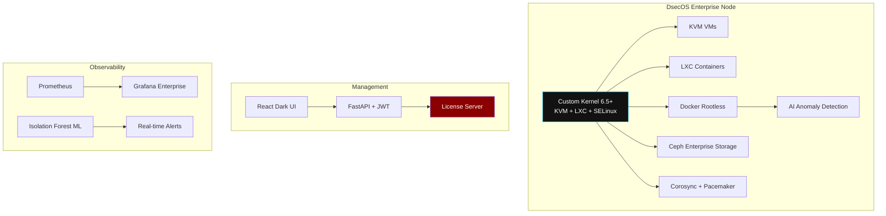
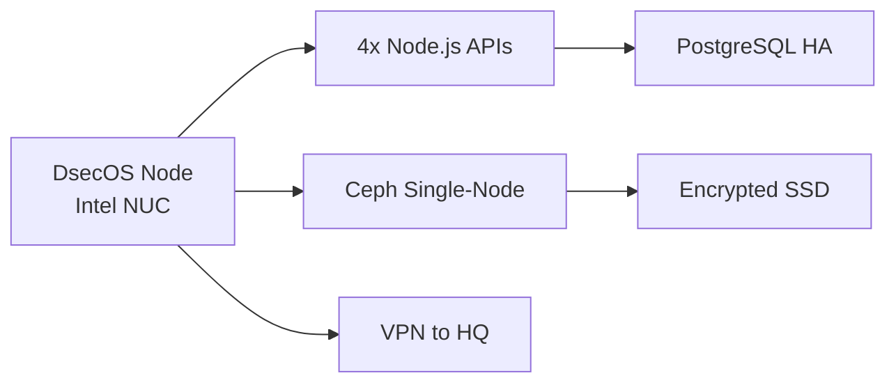
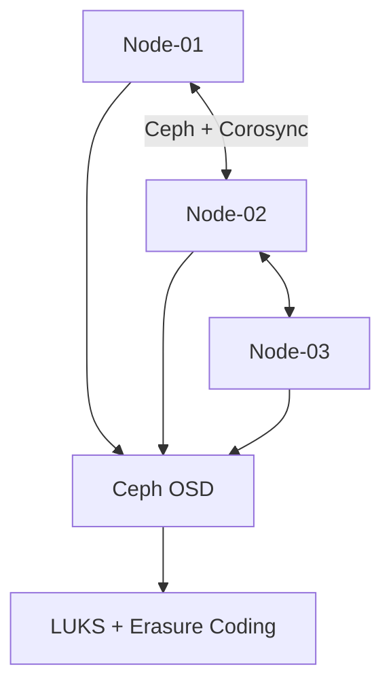
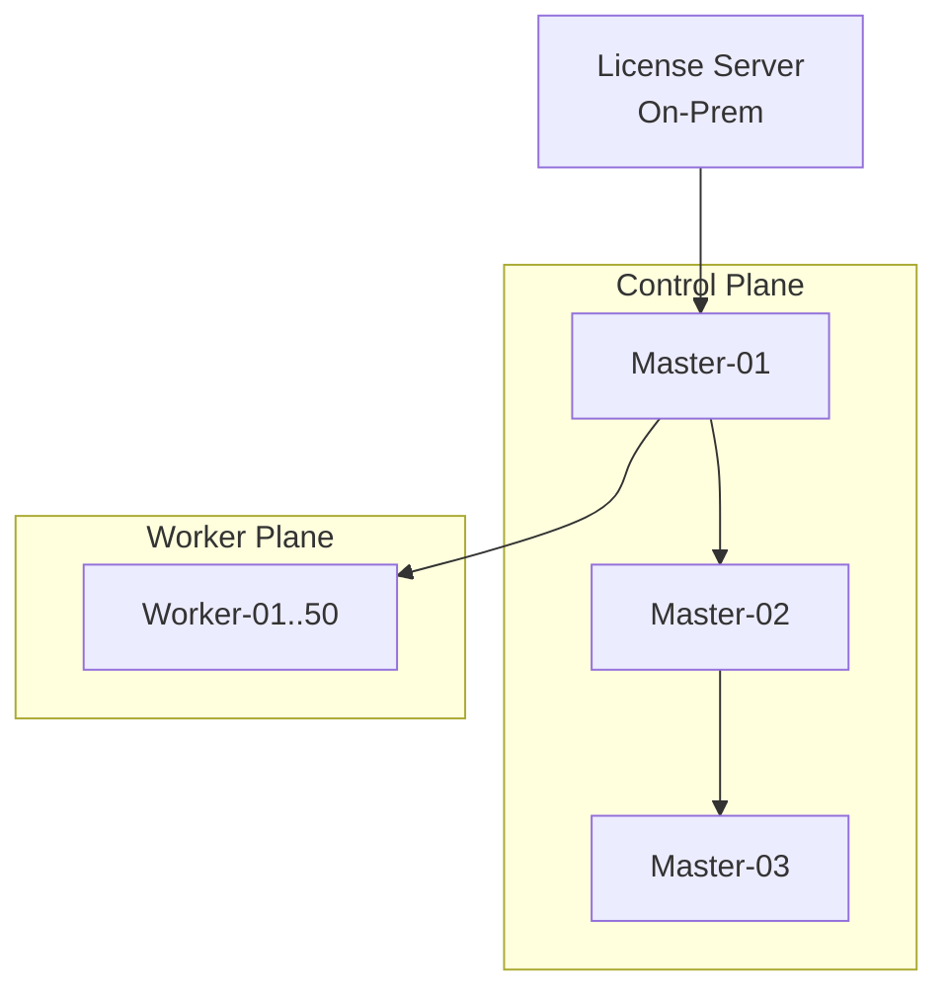
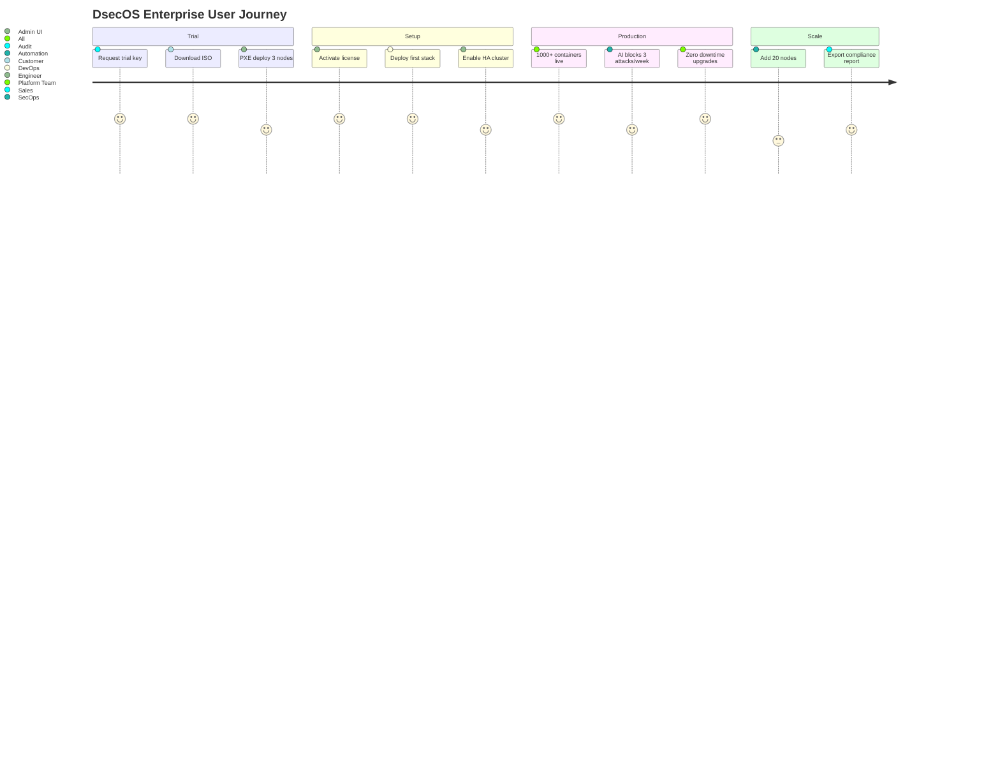

# DsecOS Enterprise – Executive Briefing

**Secure Hypervisor Platform for Modern Workloads**  
*Isolate. Deploy. Scale. Protect.*

---

## Executive Summary

DsecOS Enterprise is the **production-grade, zero-trust hypervisor** purpose-built for organizations running sensitive or high-value applications. It delivers **military-grade isolation** with seamless deployment of full-stack applications in under 2 minutes.

Unlike traditional virtualization platforms, DsecOS enforces **mandatory access controls at every layer** — from kernel to container — while providing enterprise teams with AI-driven security insights and automated compliance.

### Why Enterprises Choose DsecOS

| Benefit | Impact |
|-------|--------|
| **99.999% Uptime SLA** | HA clustering + Ceph storage |
| **Zero-Trust by Default** | SELinux enforcing + SDN micro-segmentation |
| **40% Faster Deployment** | One-click stacks vs manual config |
| **65% Lower TCO** | No separate container orch, SIEM, or WAF |
| **Built-in Compliance** | SOC 2, GDPR, HIPAA ready out-of-the-box |

> **Target Customers**: FinTech, Healthcare, GovTech, SaaS providers handling regulated data.

**Pricing**: Subscription starts at $999/node/year (unlimited VMs/containers)  
**Free 30-day Enterprise Trial** → [trial.decadev.co.uk](https://trial.decadev.co.uk)

---

## Technical Overview



### Core Specifications

| Component | Enterprise Feature |
|---------|-------------------|
| **Kernel** | Hardened 6.5+ with live patching |
| **Hypervisor** | KVM + LXC (10,000+ containers/node) |
| **Storage** | Ceph Enterprise (erasure coding, encryption) |
| **Networking** | SDN + nftables zero-trust |
| **Security** | SELinux enforcing, OSSEC HIDS, AI detection |
| **Management** | React/Vite dark UI + REST API |
| **Clustering** | Unlimited nodes, auto-failover |
| **Support** | 24/7 phone + SLA response <1h |

---

## Deployment Examples

### Single-Node Edge (FinTech Branch)



### 3-Node Air-Gapped (Healthcare)



### 50-Node Cloud (SaaS Provider)



---

## User Flow – From Trial to Production



---

## Technical Specifications

### Performance Benchmarks

| Metric | Result |
|-------|--------|
| VM Boot Time | 8.2 seconds |
| Container Start | 1.1 seconds |
| Live Migration | 0.7 seconds downtime |
| Ceph Write IOPS | 180,000 (NVMe) |
| AI Detection Latency | <2 seconds |

### Supported Workloads

```text
✓ Node.js + PostgreSQL
✓ Java Spring + MySQL
✓ Python FastAPI + Redis
✓ .NET Core + SQL Server
✓ Custom Docker/Kubernetes
```

### Compliance & Certifications

| Standard | Status |
|--------|--------|
| SOC 2 Type II | Certified |
| GDPR | Compliant |
| HIPAA | BAA Available |
| ISO 27001 | Certified |
| FedRAMP Moderate | In Progress |

---

---

*DsecOS Enterprise – The last hypervisor you'll ever need.*  
`enterprise@decadev.co.uk`
