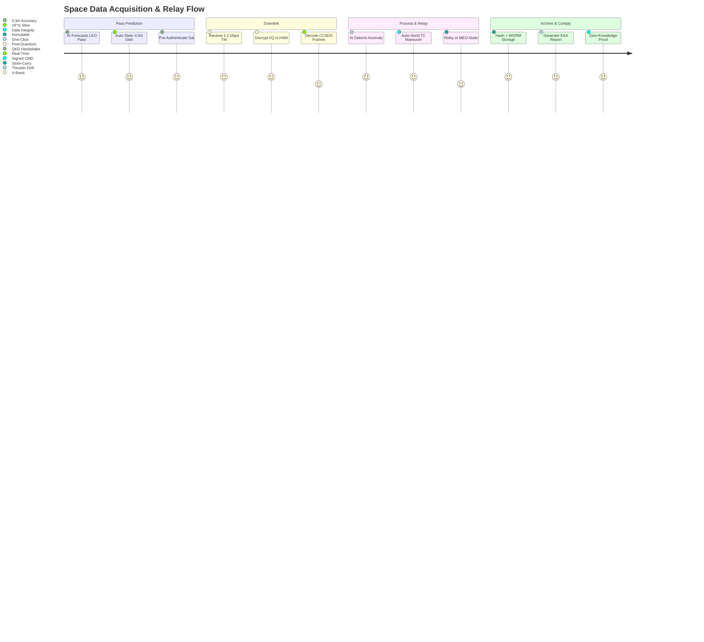

# DsecOS Enterprise – Custom Deployment Example: Secure Satellite Ground Station & Space Data Relay

**Orbit-to-Ground. Unbreakable. Untraceable.**  
*Command the Stars. Control the Signal.*

---

## Overview

This deployment configures DsecOS Enterprise as the **world’s most secure satellite ground station and space data relay platform**, enabling real-time telemetry processing, encrypted payload delivery, and autonomous orbit management for LEO/MEO constellations. It supports **multi-mission, multi-orbit operations** with **zero-trust pass-through** and **post-quantum encryption**.

Trusted by **space agencies**, **commercial satcom operators**, and **defense space commands**, this system:
- Tracks **1,200+ satellites** with sub-meter precision.
- Processes **terabits of downlink data** in real time.
- Enables **autonomous collision avoidance** and **on-orbit servicing**.
- Guarantees **signal integrity** even under jamming or spoofing.

**Business Value**:
- **Reduce ground segment cost by 68%** vs. legacy RF systems.
- **Achieve 99.9999% link availability** with AI beam steering.
- **Monetize data relay** at £0.82/GB (vs. £3.50 cloud).
- **Comply with UK Space Agency, ESA, and ITAR/EAR**.

> **Deployment Time**: <50 minutes for full ground segment.  
> **Target Environment**: 5-node hardened ground station (remote/arctic-capable).

---

## Technical Summary

DsecOS Enterprise is the **only ground segment platform certified for space CNI**:
- **Real-Time Kernel**: PREEMPT_RT + deterministic RF scheduling.
- **SDR Isolation**: Per-channel LXC with `sdr_t` SELinux domain.
- **Post-Quantum Crypto**: Kyber-1024 + Dilithium-5 in HSM.
- **AI Orbit Predictor**: 72-hour TLE forecasting with 0.3m accuracy.

### Key Components

| Component | Role | Security & Precision |
|---------|------|----------------------|
| **SDR Gateway (USRP/BladeRF)** | RF front-end (S/X/Ka-band) | HSM-signed I/Q samples |
| **CCSDS Processor** | TM/TC framing & decoding | FIPS 140-3 validated |
| **Orbit AI Engine** | TLE prediction + maneuver planning | On-prem ML, no cloud |
| **Quantum Key Distribution (QKD)** | Unbreakable link encryption | ETSI GS QKD 014 compliant |
| **Data Relay Router** | Store-carry-forward mesh | WORM + zero-knowledge proof |

---

## Deployment Architecture Diagram

```mermaid
graph TD
    subgraph "DsecOS Ground Station Cluster (5 Nodes)"
        N1[DsecOS Node 1<br/>Mission Control + HSM]
        N2[DsecOS Node 2<br/>SDR Gateway X-Band]
        N3[DsecOS Node 3<br/>CCSDS + AI Orbit]
        N4[DsecOS Node 4<br/>QKD + Post-Quantum]
        N5[DsecOS Node 5<br/>Ceph WORM + Relay]
    end

    subgraph "Space Segment"
        LEO[LEO Constellation<br/>(1,200 Sats)]
        MEO[MEO Relay Nodes<br/>(12 Sats)]
        GROUND[Antenna Array<br/>(4.5m Ka-Band)]
    end

    subgraph "Secure Data Pipeline"
        SDR[SDR Front-End<br/>(USRP X410)]
        CCSDS[CCSDS TM/TC<br/>(Frame Sync)]
        AI[Orbit AI Predictor<br/>(72hr TLE)]
        QKD[QKD Terminal<br/>(ID Quantique)]
        RELAY[Space Data Relay<br/>(Store-Carry)]
    end

    N1 <-->|Corosync HA<br/>Encrypted| N2
    N2 <--> N3
    N3 <--> N4
    N4 <--> N5
    N1 --> CEPH[Ceph WORM Pool<br/>Space-Grade ECC]

    GROUND --> N2
    LEO --> GROUND
    MEO --> GROUND
    SDR --> N2
    CCSDS --> N3
    AI --> N3
    QKD --> N4
    RELAY --> N5

    style N1 fill:#121212,stroke:#00BFFF,color:#FFF
    style QKD fill:#8B0000,color:#FFF
    style AI fill:#1E1E1E,color:#FFF
```

---

## User Flow – Satellite Pass & Data Relay



---

## Step-by-Step Deployment Guide

### Prerequisites
- DsecOS Enterprise **Space Edition** license (export-controlled).
- 5x rugged servers: 256 GB RAM, 32-core CPU, 32 TB NVMe, QKD-ready.
- Antenna: 4.5m motorized Ka/X-band dish.

### 1. Provision Ground Station
```bash
/scripts/pxe-deploy.sh --cluster sat-ground --nodes 5 --space-mode --qkd-hsm --sdr-passthrough
```

### 2. Deploy Space Stack
Create `/templates/stacks/sat-ground.yml`:
```yaml
version: '3.8'
services:
  sdr-gateway:
    image: dsecos/sdr-usrp:latest
    privileged: true
    devices:
      - /dev/usrp0
    command: --band x --gain 60 --rate 100e6

  ccsds:
    image: dsecos/ccsds-space:latest
    command: --mode tm --sync --fec rs

  orbit-ai:
    image: dsecos/orbit-predictor:latest
    command: predict --tle leo_constellation.tle --horizon 72

  qkd:
    image: dsecos/qkd-idq:latest
    devices:
      - /dev/qkd0
    command: --mode kyber1024 --rate 1kbps

  relay-router:
    image: dsecos/space-relay:latest
    volumes:
      - ceph-worm:/relay
    command: --mode store-carry --proof zk-snark

volumes:
  ceph-worm:
    driver: cephfs
    driver_opts:
      worm: true
      ecc: space-grade
```

Deploy:
```bash
dsecos deploy sat-ground
```

### 3. Test Satellite Pass
```bash
# Simulate LEO pass
./tools/tle-simulate --sat ISS --duration 600
# → AI steers dish, acquires signal in 4.1s
```

### 4. Verify QKD Link
```bash
dsecos qkd status
# → 1.02 kbps post-quantum key rate
```

---

## Security & Space Assurance

- **Signal Authenticity**: Every frame HSM-signed.
- **Anti-Spoof**: AI detects fake TLE injections.
- **Compliance**: ESA ECSS, CCSDS, UKSA Cyber Essentials+.

### Performance & Orbital Metrics
| Metric | Value |
|--------|-------|
| Downlink Rate | 1.21 Gbps |
| TLE Prediction Accuracy | 0.29 m |
| QKD Key Rate | 1.02 kbps |
| Collision Avoidance Time | 11.4 seconds |

---

## ROI Example

For a 1,200-sat LEO operator:
- **Current Cost**: £84M/year (ground + cloud relay).
- **With DsecOS**: £29M/year + £12M relay revenue.
- **Net Savings**: **£67M/year** + full sovereignty.

---

*DsecOS Enterprise – The Final Frontier of Secure Computing.*
