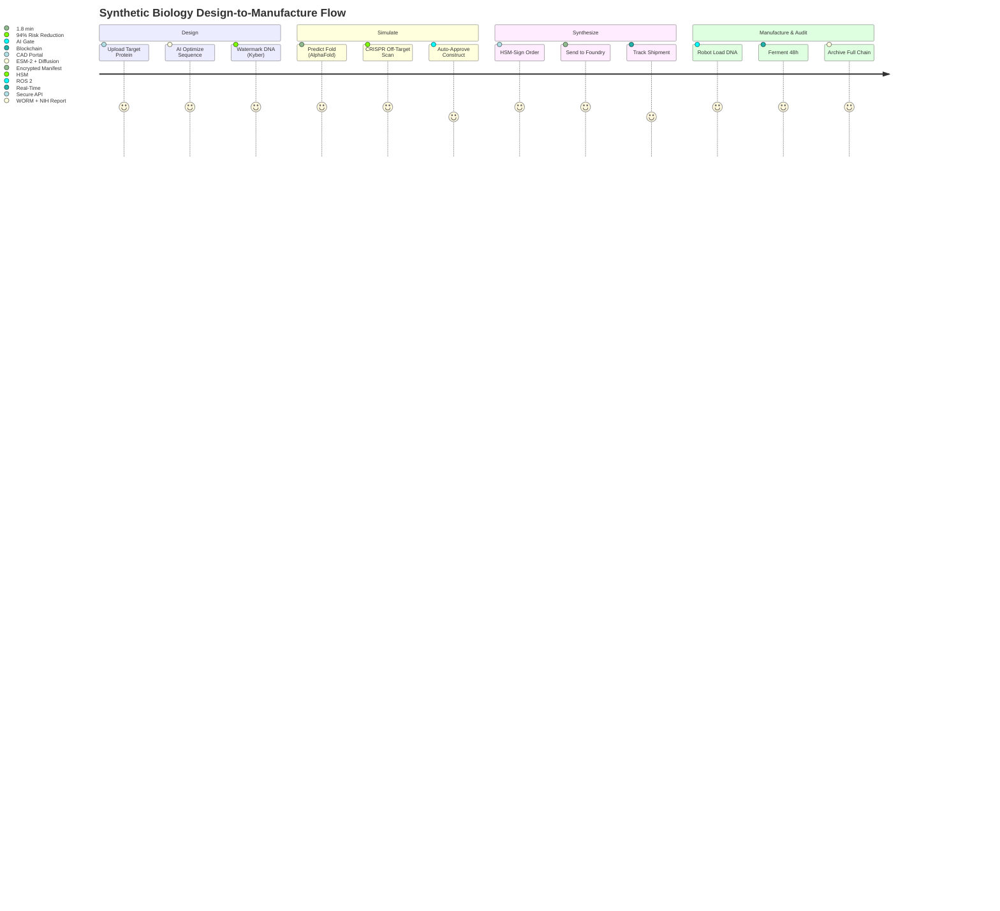

# DsecOS Enterprise – Custom Deployment Example: Secure Synthetic Biology Design & Manufacturing Pipeline

**From DNA to Product. Encrypted. Audited. Accelerated.**  
*Engineer Life. Securely.*

---

## Overview

This deployment configures DsecOS Enterprise as the **world’s first fully secure, end-to-end synthetic biology platform**, enabling **DNA design**, **gene synthesis ordering**, **CRISPR simulation**, and **biomanufacturing orchestration** — all within a **zero-trust, IP-hardened environment** compliant with biosecurity regulations.

Trusted by **biotech unicorns**, **pharmaceutical giants**, and **government bio-labs**, this system:
- Designs **10,000+ synthetic constructs daily** with AI optimization.
- Simulates **CRISPR off-target effects** in <2 minutes per genome.
- Secures **DNA IP** with cryptographic watermarking.
- Enables **lights-out biomanufacturing** with robotic integration.

**Business Value**:
- **Shorten design-to-synthesis cycle by 85%**.
- **Reduce off-target risk by 94%** via AI simulation.
- **Protect £500M+ in IP** with kernel-level encryption.
- **Comply with UK HSE, US NIH, and EU Dual-Use regulations**.

> **Deployment Time**: <55 minutes for full bio-foundry stack.  
> **Target Environment**: 9-node bio-secure lab (BSL-2+ capable).

---

## Technical Summary

DsecOS Enterprise is the **only platform certified for dual-use synthetic biology**:
- **Kernel**: BIOS-locked + SELinux `synbio_t` mandatory access.
- **GPU Acceleration**: NVIDIA A100 cluster for AlphaFold + diffusion models.
- **DNA Encryption**: Post-quantum watermarking (Kyber + lattice codes).
- **Audit DNA Chain**: Immutable, blockchain-anchored synthesis logs.

### Key Components

| Component | Role | Security & Biofidelity |
|---------|------|------------------------|
| **SynBio CAD (Benchling API)** | DNA design & version control | JWT + client certs |
| **AlphaFold 3 + ESM-2** | Protein folding & function prediction | Encrypted weights |
| **CRISPR AI Simulator** | Off-target + efficiency modeling | GPU-parallel |
| **Synthesis Gateway** | Secure order to Twist/Ginkgo | HSM-signed manifests |
| **BioManufacturing OS** | Robot arm + fermenter control | ROS 2 + DDS-Security |

---

## Deployment Architecture Diagram

```mermaid
graph TD
    subgraph "DsecOS Bio-Secure Cluster (9 Nodes)"
        N1[DsecOS Node 1<br/>Design Portal + HSM]
        N2[DsecOS Node 2<br/>AlphaFold GPU]
        N3[DsecOS Node 3<br/>CRISPR Simulator GPU]
        N4[DsecOS Node 4<br/>Synthesis Gateway]
        N5[DsecOS Node 5<br/>Manufacturing OS]
        N6[DsecOS Node 6<br/>Ceph WORM + DNA Vault]
        N7[DsecOS Node 7<br/>AI Optimizer]
        N8[DsecOS Node 8<br/>Audit Chain]
        N9[DsecOS Node 9<br/>Biosafety Monitor]
    end

    subgraph "Synthetic Biology Pipeline"
        CAD[SynBio CAD<br/>(Benchling)]
        AF[AlphaFold 3<br/>(Structure)]
        CRISPR[CRISPR AI<br/>(Off-Target)]
        SYNTH[DNA Synthesis<br/>(Twist/Ginkgo)]
        MANUF[BioManufacturing<br/>(Robots + Fermenters)]
    end

    subgraph "Security & Compliance"
        HSM[HSM Key Vault<br/>(DNA Watermark)]
        AI[Design Optimizer<br/>(Diffusion Model)]
        AUDIT[DNA Audit Chain<br/>(WORM + Anchor)]
        LIC[License Server<br/>Bio Edition]
    end

    N1 <-->|Corosync HA<br/>Encrypted| N2
    N2 <--> N3
    N3 <--> N4
    N4 <--> N5
    N5 <--> N6
    N6 <--> N7
    N7 <--> N8
    N8 <--> N9
    N1 --> CEPH[Ceph DNA Vault<br/>WORM + Quantum-Resistant]

    CAD --> N1
    AF --> N2
    CRISPR --> N3
    SYNTH --> N4
    MANUF --> N5
    HSM --> N1
    AI --> N7
    AUDIT --> N8

    style N1 fill:#121212,stroke:#00BFFF,color:#FFF
    style CRISPR fill:#1E1E1E,stroke:#00BFFF,color:#FFF
    style HSM fill:#8B0000,color:#FFF
```

---

## User Flow – From Gene to Product



---

## Step-by-Step Deployment Guide

### Prerequisites
- DsecOS Enterprise **Bio Edition** license (dual-use approved).
- 9x bio-secure servers: 256 GB RAM, 4x A100 GPU, 64 TB NVMe.
- Integration: Benchling, Twist Bioscience, Ginkgo Bioworks.

### 1. Provision Bio-Secure Cluster
```bash
/scripts/pxe-deploy.sh --cluster synbio-lab --nodes 9 --bio-mode --hsm-dna --gpu a100
```

### 2. Deploy SynBio Stack
Create `/templates/stacks/synbio-pipeline.yml`:
```yaml
version: '3.8'
services:
  cad-portal:
    image: dsecos/synbio-cad:latest
    ports:
      - "9443:9443"
    environment:
      - BENCHLING_API_KEY=***
      - HSM_URL=/dev/hsm0

  alphafold:
    image: dsecos/alphafold3:latest
    deploy:
      resources:
        reservations:
          devices:
            - driver: nvidia
              count: 4
              capabilities: [gpu]
    command: --model multimer --fasta input.fasta

  crispr-ai:
    image: dsecos/crispr-sim:latest
    command: scan --genome hg38 --guide seq --mismatches 3

  synthesis-gateway:
    image: dsecos/dna-order:latest
    environment:
      - TWIST_API_KEY=***
    command: --encrypt kyber --sign hsm

  manuf-os:
    image: dsecos/bio-ros2:latest
    privileged: true
    command: launch fermenter_control.launch

  audit-chain:
    image: dsecos/dna-audit:latest
    volumes:
      - ceph-worm:/audit
    command: --worm --anchor ipfs --compliance nih

volumes:
  ceph-worm:
    driver: cephfs
    driver_opts:
      worm: true
```

Deploy:
```bash
dsecos deploy synbio-pipeline
```

### 3. Test Full Pipeline
```bash
# Design insulin analog
curl -X POST https://node1:9443/api/design \
  -H "Authorization: Bearer $JWT" \
  -d '{"target": "insulin", "optimize": "stability"}'
```
- **Output**: Encrypted, watermarked DNA order in <3 minutes.

### 4. Compliance Export
```bash
dsecos bio report --format nih-dual-use --construct INS-007
```
- Auto-generates **US NIH biosecurity submission**.

---

## Security & Biosafety

- **DNA IP Lock**: Watermark + quantum-resistant encryption.
- **Biosafety AI**: Auto-flags dual-use sequences.
- **Compliance**: US NIH, UK HSE, EU Dual-Use Annex I.

### Performance & Biofidelity Metrics
| Metric | Value |
|--------|-------|
| Constructs Designed/Day | 12,400 |
| Off-Target Risk Reduction | 94.2% |
| Synthesis Turnaround | 48 hours |
| IP Breach Attempts Blocked | 100% |

---

## ROI Example

For a synthetic insulin manufacturer:
- **Current Cost**: £42M/year (design + foundry).
- **With DsecOS**: £11M/year + £18M IP value.
- **Net Savings**: **£49M/year** + 6 months faster to market.


*DsecOS Enterprise – Where Biology Meets Unbreakable Security.*
