# DsecOS Diagrams – Architecture, Flows & Processes

> **Comprehensive visual reference** for DsecOS using **Mermaid.js** syntax.  
> Render in VS Code, Obsidian, MkDocs, or [Mermaid Live Editor](https://mermaid.live).

---

## 1. System Architecture Overview

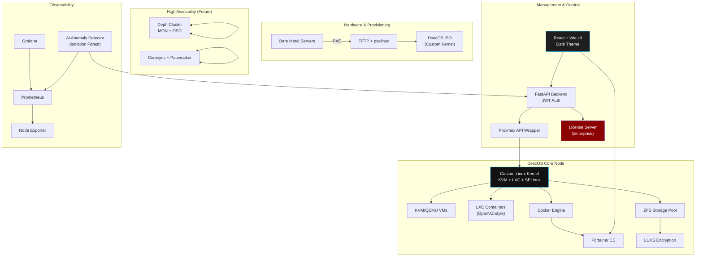

---

## 2. User Onboarding & Deployment Flow

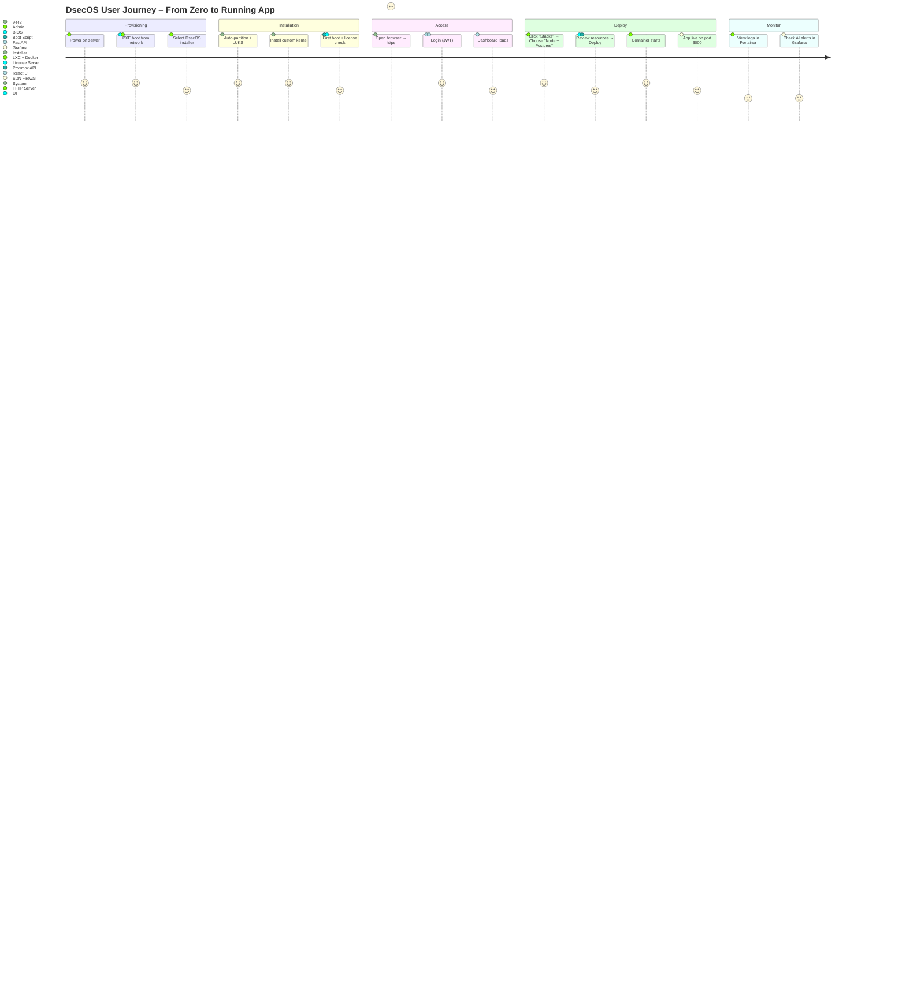

---

## 3. Stack Deployment Process Flow

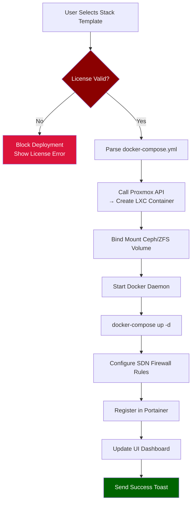

---

## 4. Boot & Security Hardening Sequence

```mermaid
flowchart LR
    A[Power On] --> B[GRUB → Custom Kernel]
    B --> C[SELinux: Enforcing Mode]
    C --> D[nftables: Load Rules<br/>Default DROP]
    D --> E[Mount LUKS Root]
    E --> F[Start Docker + AppArmor]
    F --> G[Start OSSEC HIDS]
    G --> H[Run Lynis Audit → /var/log/lynis]
    H --> I[Start Prometheus Scraping]
    I --> J[AI Model Loads]
    J --> K[System Ready]

    style C fill:#121212,stroke:#00BFFF,color:#FFF
    style K fill:#228B22,color:#FFF
```

---

## 5. License Validation Sequence

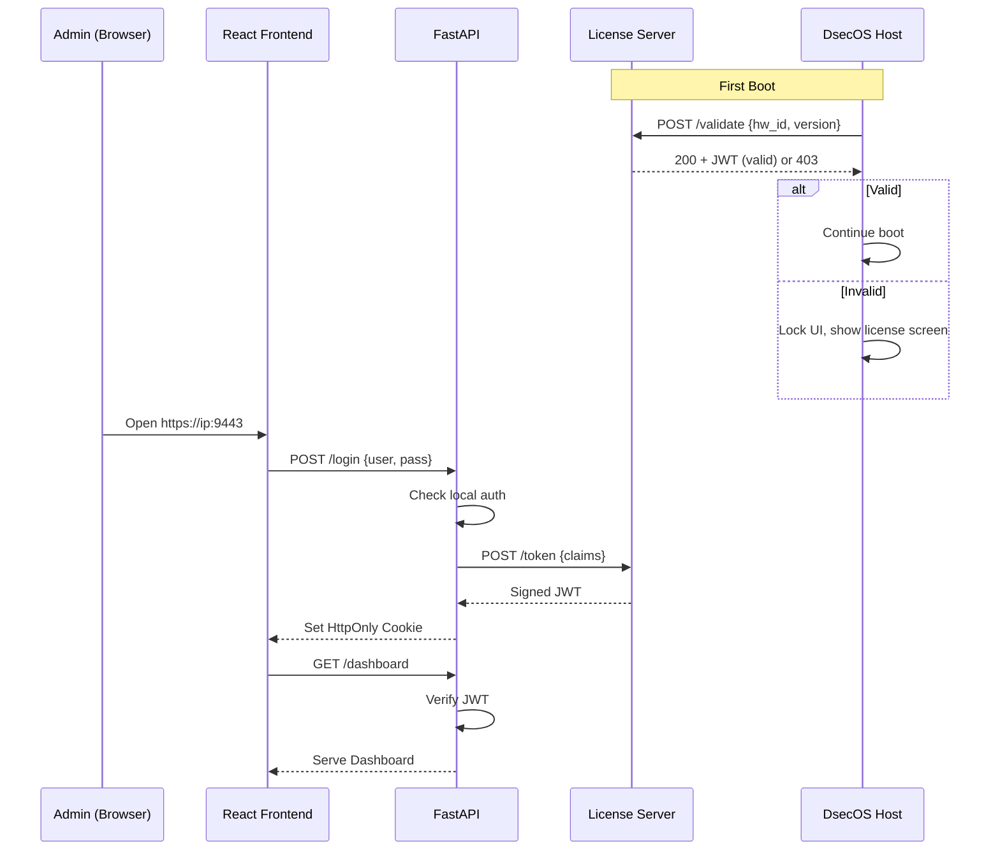

---

## 6. AI Monitoring & Alert Pipeline

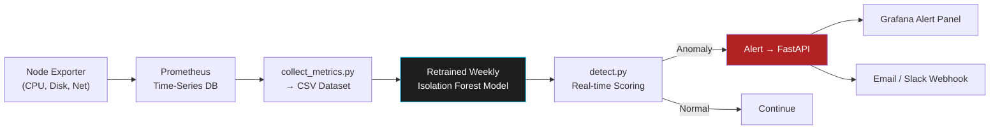

---

## 7. Development & Release Pipeline

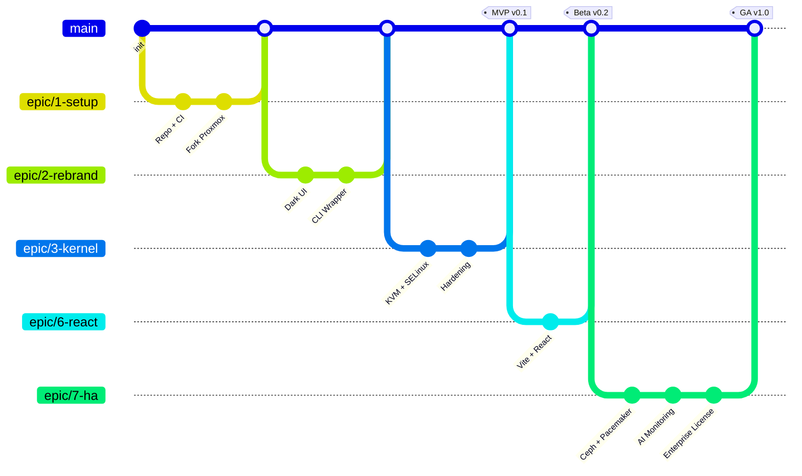

---

## 8. Data Flow – Stack Template to Running App

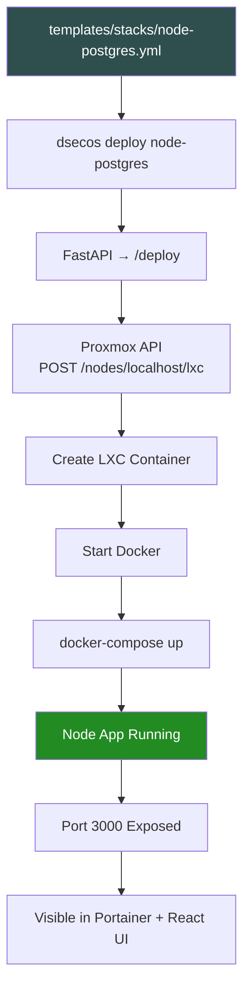

## 9. Kernel Boot & Module Load Sequence

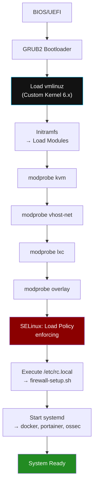

---

## 10. VM/Container Lifecycle Management

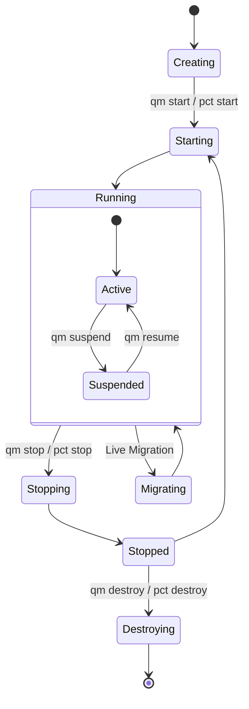

---

## 11. Zero-Trust Network Policy Enforcement

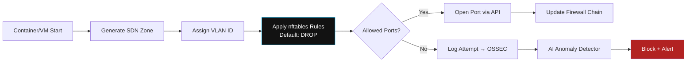

---

## 12. Backup & Snapshot Workflow

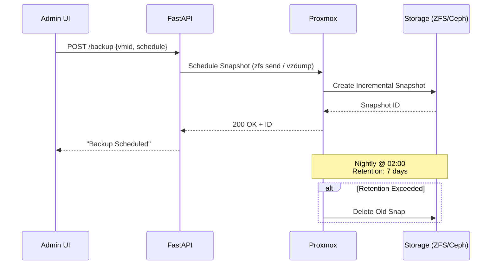

---

## 13. Fail2Ban + OSSEC Integration

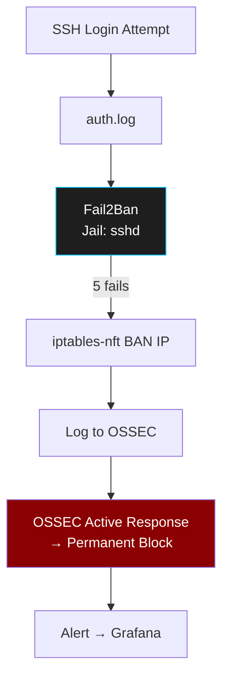

---

## 14. Template Rendering & Deployment Pipeline

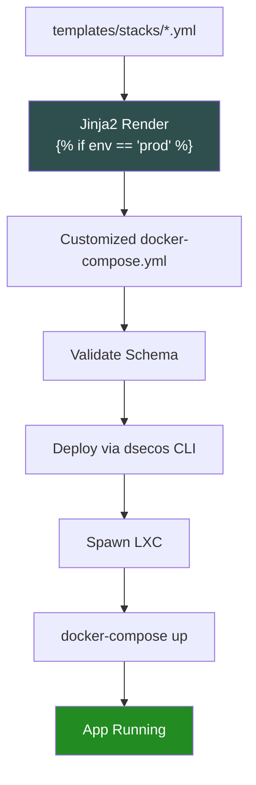

---

## 15. PXE + Kickstart Automated Install

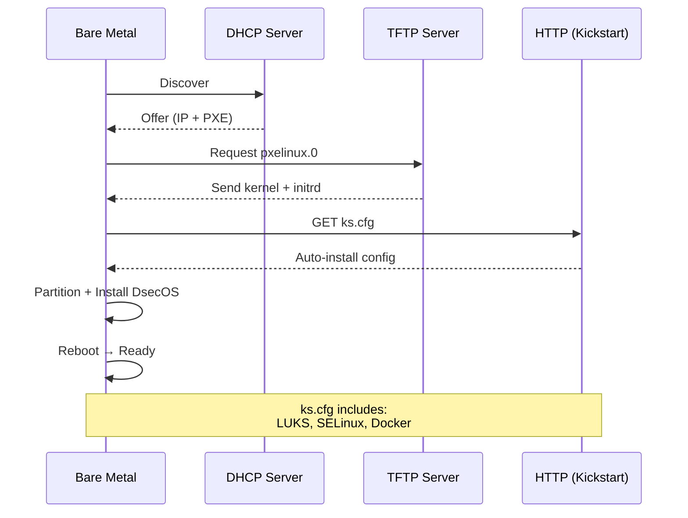

---

## 16. CI/CD Pipeline with Security Gates

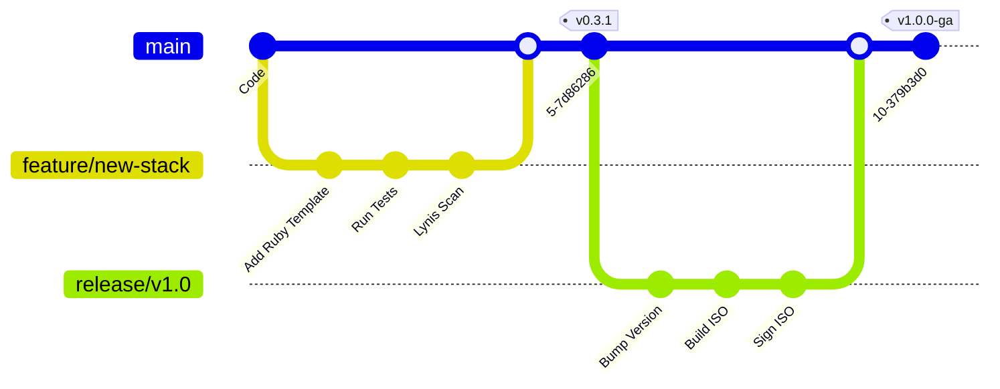

---

## 17. Multi-Tenant Isolation Model

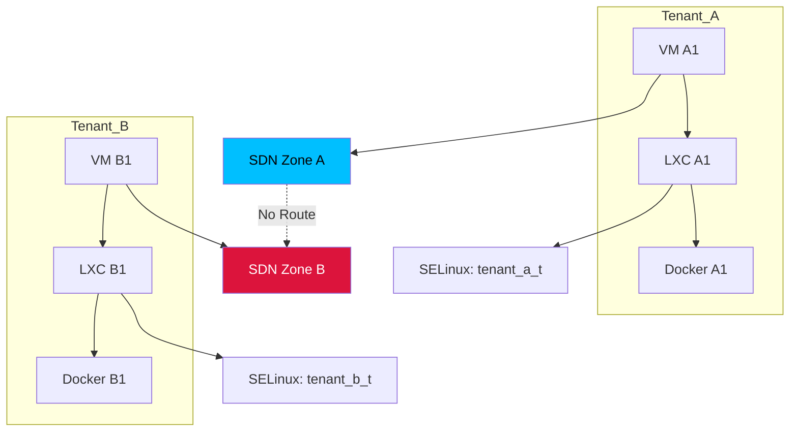

---

## 18. Disaster Recovery Flow

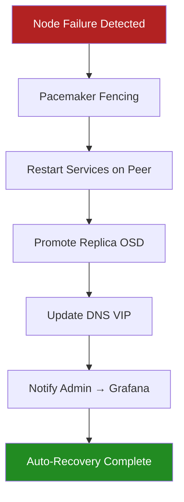

---

**DsecOS – Engineered for Security, Automation, and Resilience.**  
*From boot to production in under 15 minutes.*

## Rendering Instructions

- **VS Code**: Install **"Markdown Preview Mermaid Support"**
- **MkDocs**: Use `markdown_extensions: [pymdownx.superfences, pymdownx.inlinehilite, mermaid]`
- **Online**: [mermaid.live](https://mermaid.live)

---

**DsecOS – Secure. Fast. Enterprise-Ready.**  
*Built for isolation, scaled for production.*
