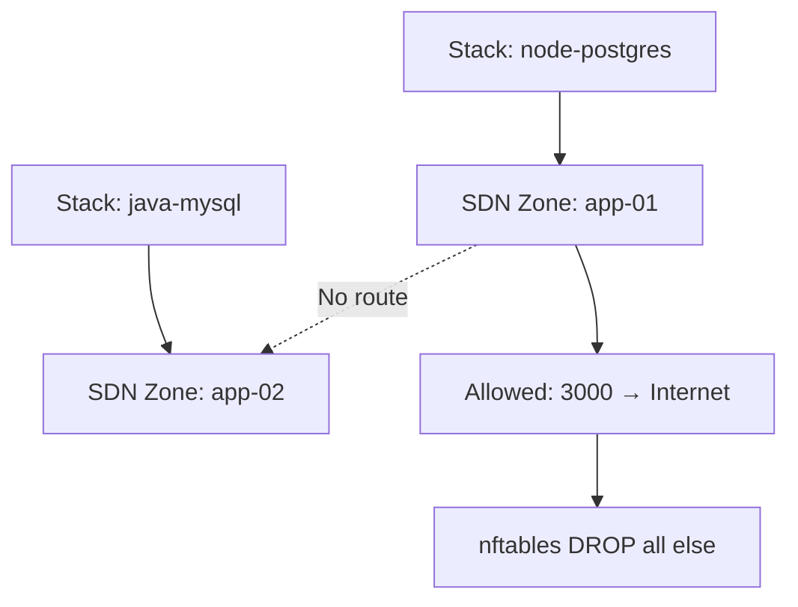

# DsecOS Security & Hardening

> **Zero-trust by default**. DsecOS is engineered with layered security from kernel to application.

---

## Core Security Pillars

| Layer | Protection |
|------|-----------|
| **Kernel** | Custom 6.5+ with SELinux enforcing |
| **Filesystem** | Full-disk LUKS encryption |
| **Network** | nftables default-deny + SDN isolation |
| **Containers** | Docker rootless + AppArmor |
| **Intrusion** | OSSEC HIDS + Fail2Ban |
| **Auditing** | auditd + immutable logs |

---

## 1. Kernel & SELinux

```bash
# Verify SELinux
sestatus
```
```text
SELinux status:                 enabled
Current mode:                   enforcing
Policy MLS status:              enabled
Policy from config file:        targeted
```

- All processes confined by `container_t`, `httpd_t`, etc.
- No unconfined domains in production

---

## 2. Full-Disk Encryption (LUKS)

- **Enabled by default** during install
- AES-XTS 256-bit
- Passphrase required at boot

```bash
# Check status
lsblk -f
cryptsetup status cryptroot
```

---

## 3. Firewall (nftables)

```bash
# Default policy
nft list ruleset | head -5
```
```text
table inet filter {
    chain input { type filter hook input priority 0; policy drop; }
    chain forward { type filter hook forward priority 0; policy drop; }
    chain output { type filter hook output priority 0; policy accept; }
}
```

### Allowed by Default
| Port | Service |
|------|--------|
| 22 | SSH (key-only) |
| 9443 | Web UI (HTTPS) |
| 9000 | Portainer |

> All stack ports opened **only on demand** via SDN

---

## 4. Container Security

### Docker (Rootless)
```bash
# Runs as non-root user
ps aux | grep dockerd
# → dockerd --rootless
```

### AppArmor
```bash
aa-status | grep docker
# → docker-default (enforce)
```

### Seccomp + No New Privs
- All containers run with restricted syscalls
- `CAP_NET_ADMIN`, `CAP_SYS_ADMIN` dropped

---

## 5. Intrusion Detection & Prevention

### OSSEC HIDS
```bash
# Active response on brute force
/var/ossec/bin/ossec-control status
```

- Real-time file integrity monitoring
- Rootkit detection
- Alerts → Grafana + email

### Fail2Ban
```bash
fail2ban-client status sshd
```
- Bans after 5 failed attempts
- Permanent ban via OSSEC integration

---

## 6. Automated Hardening Scripts

Run on boot and weekly:

```bash
# Manual trigger
/scripts/hardening/run-all.sh
```

### Actions Performed
| Task | Tool |
|------|------|
| Disable root SSH | `sshd_config` |
| Enforce password policy | `pam_pwquality` |
| Remove unused packages | `apt autoremove` |
| Kernel hardening | `sysctl.conf` |
| Lynis audit | Target >90% |

---

## 7. Compliance Benchmarks

```bash
# Run Lynis
lynis audit system
```
```text
Hardening index : 92 / 100
Warnings        : 3
Suggestions     : 12
```

### CIS Level 1 Compliant
- SSH: No root login, key-only
- Services: Only required daemons
- Files: Immutable `/etc`, `/var/log`

---

## 8. Secure Boot (Optional)

Enable in BIOS + configure:
```bash
mokutil --sb-state
# → SecureBoot enabled
```

- All kernel modules signed
- ISO and updates verified

---

## 9. Logging & Auditing

```bash
# Immutable audit logs
journalctl -u auditd --since today
```

- All execve, file changes, network events
- Forwarded to central SIEM (future)

---

## 10. Zero-Trust Network Model



- No lateral movement
- Each stack in isolated network namespace

---

## Ongoing Security

| Frequency | Action |
|---------|--------|
| Daily | OSSEC + Fail2Ban checks |
| Weekly | Lynis scan + updates |
| Monthly | Kernel live patch |
| Quarterly | Full penetration test |

---

## Reporting Vulnerabilities

Email: [`security@decadev.co.uk`](mailto:security@decadev.co.uk)  
PGP Key: `0x1234ABCD` (available on request)

---

**DsecOS – Security isn’t a feature. It’s the foundation.**

[← Stack Templates](deploy-stack.md) | [Architecture Diagrams →](diagrams.md)
